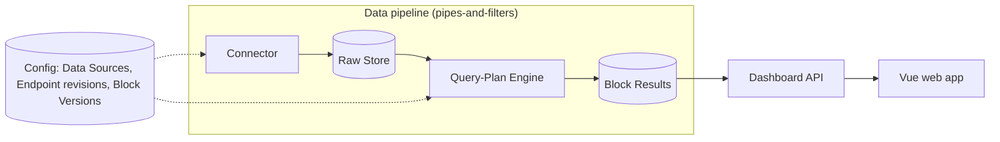
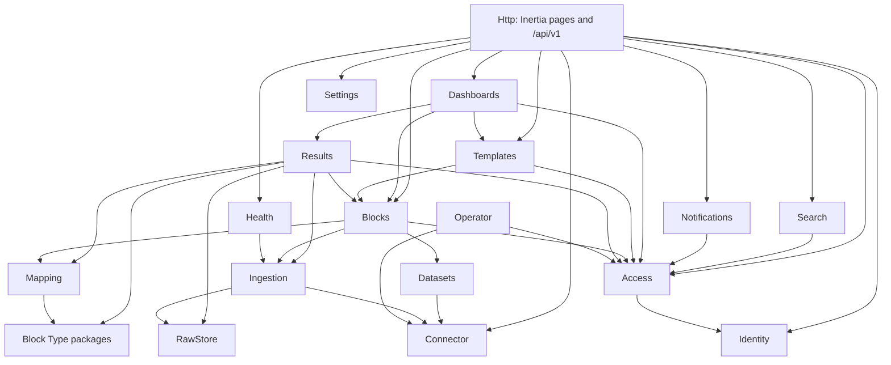
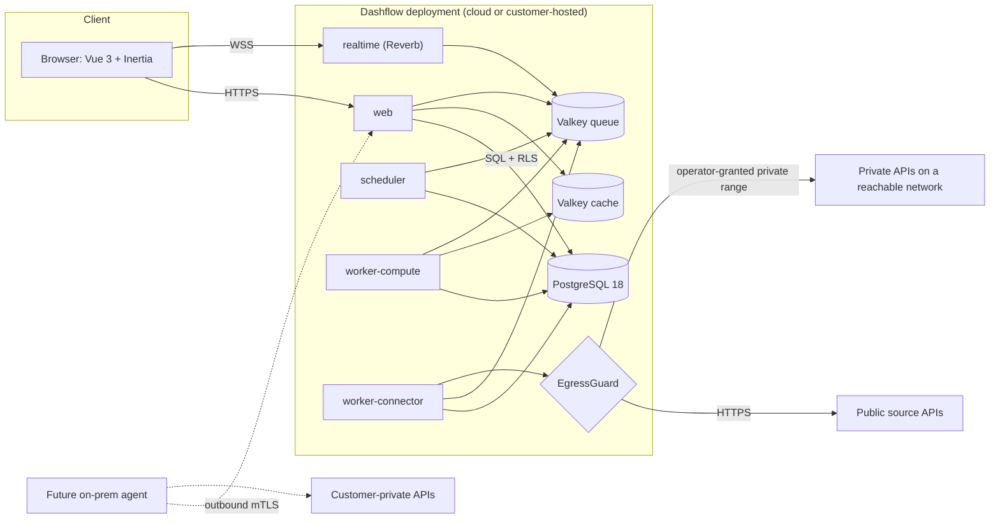
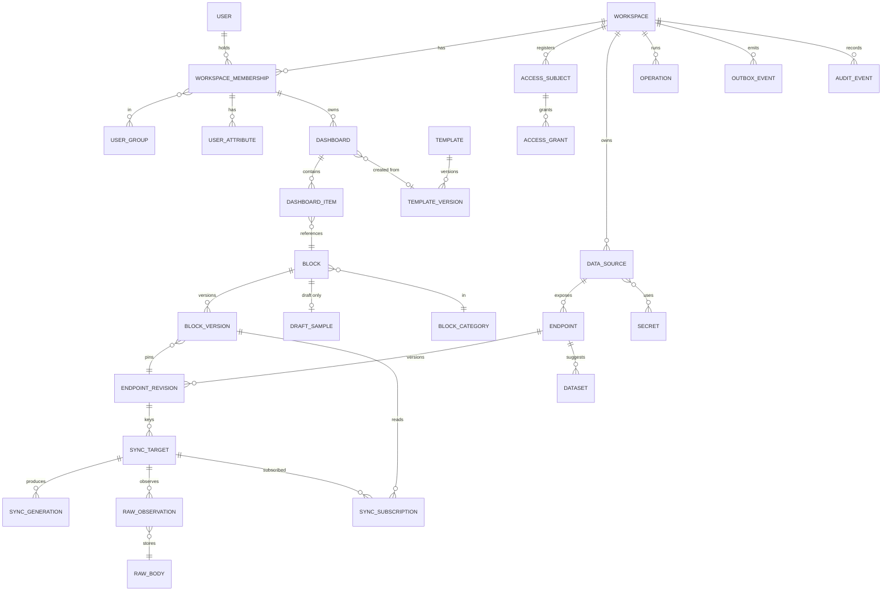

# Architecture Spine — Dashflow

**Tags.** Each AD is tagged **[CONFIRMED]** (settled by the PRD, UX or product owner), **[PROPOSED]** (architecture recommendation awaiting product-owner confirmation), or both, for a confirmed rule with proposed mechanics. Values awaiting client input are named `pending_input` settings, never invented. Open conflicts are listed in SOLUTION-DESIGN.md §0.

## Design Paradigm

One Laravel codebase and one container image, run as several **process roles**. Inside it there are **modules**.
- Each module exposes a public `Contracts` namespace: commands, queries, DTOs, events and ports.
- `Domain`, `Application`, `Infrastructure` and `Http` stay private to the module.

Data moves through a **pipeline of filters**: Connector → Raw Store → Datasets/Query Plan → Results → Dashboard API. Dashboards only **read materialized Block Results** (CQRS-lite). Nothing on the read path calls a source API.



Module dependencies (AD-2): an arrow means "may call the Contracts of". The graph is generated from `tests/Architecture/dependencies.php`, which is the source of truth.



- **Kernel.** Every module may also call the platform kernel (`app/Platform`). The kernel calls no module:
  - `Tenancy`: workspaces and settings;
  - `Outbox`, `Audit`;
  - `Operations`: the async-operation registry;
  - `EditLock`;
  - `Layout`: placement, clamp, collisions;
  - `Period`: `PeriodResolver`.
- **No reverse edges.** A module that needs data from a module downstream of it subscribes to that module's AD-29 events and keeps a **read model it owns**. Examples:
  - Results `block_viewers`, fed by `dashboards.dashboard.changed`;
  - Blocks `block_usage` for impact counts;
  - Connector `endpoint_usage` for "Blocks using it";
  - Search documents, fed by every subject event.
- Event subscription is not a dependency edge.

## Invariants & Rules

### AD-1 — Modular monolith, process roles from one image [CONFIRMED 2026-10-05]

- **Binds:** all
- **Prevents:** premature microservices; drift between images; a separate service per Platform-health row
- **Rule:**
  - One Laravel 13 codebase, one image. The roles are:
    - `web` (HTTP and Inertia);
    - `realtime` (Reverb);
    - `scheduler` (`schedule:run` each minute; tasks use `onOneServer()`; the sync dispatcher runs every `dispatch_tick` (a tunable; proposed default 5 s) with `onOneServer()`);
    - `worker-connector` (queues `fetch-interactive`, `fetch-scheduled`);
    - `worker-compute` (queues `compute`, `outbox`, `notifications`, `maintenance`).
  - A new deployable needs a new AD.
  - The Platform-health "services" (FR-66) are logical components mapped onto these roles.

### AD-2 — Module boundaries and dependency direction [PROPOSED; domain rule CONFIRMED]

- **Binds:** all modules; FR-33, NFR-12
- **Prevents:** cross-module table access; dependency cycles; domain logic in the core
- **Rule:**
  - A module reads and writes only its own tables. It calls other modules only through `Contracts`, along the edges of the diagram above.
  - Two Pest architecture tests fail CI: one on a forbidden namespace edge, one on any `DB::table()` or query naming another module's table.
  - Access never depends on Blocks or Templates. Those modules register their subjects (lifecycle visibility and access mode) through `Access\Contracts\RegisterAccessSubject`, in the same transaction as the change.
  - No domain vocabulary (RMG or any other) appears in core code, schemas or seeds.

### AD-3 — Workspace tenancy, enforced twice and failing closed [PROPOSED]

- **Binds:** FR-3, NFR-4; every tenant-owned table, cache key, queue payload and channel
- **Prevents:** cross-tenant reads; tenant context leaking across pooled connections; ad-hoc bypass roles
- **Rule:**
  - One database, shared schema. Every tenant table has a non-null `workspace_id`, `ENABLE` and `FORCE ROW LEVEL SECURITY`, and a policy on `workspace_id = current_setting('app.workspace_id', true)::uuid`. An unset context returns no rows.
  - `WorkspaceTransaction` middleware (HTTP and job) is the only place that opens the per-request or per-job transaction and calls `set_config('app.workspace_id', …, true)`. A CI test asserts that a query with no context returns zero rows.
  - Database roles:
    - `app`: the application; no `BYPASSRLS`.
    - `migrator`: owns the tables.
    - `maintenance`: allowed to DELETE.
    - `system`: column-limited cross-tenant access to `sync_targets` dispatch columns and `outbox_events` relay columns, used only by the dispatcher and the outbox relay. Each job it enqueues carries `workspace_id`, re-enters the tenant context and re-reads every referenced ID under RLS. A mismatch is a hard failure and a security event.
    - `operator`: operator commands only.
  - **Global tables** are only `users`, `sessions`, `password_reset_tokens`, `invitations`, `service_health_samples`, `operator_audit` and the framework job tables. A migration that creates any other table without `workspace_id` fails CI.
  - A membership lookup across workspaces (for sign-in and the switcher) goes through one `SECURITY DEFINER` function owned by Access.
  - Every cache key, lock, queue payload, object key and channel name starts with the workspace ID, and cache hits re-check `workspace_id`.

### AD-4 — Identity is global; authority is per membership; access is one predicate [PROPOSED; immediacy CONFIRMED]

- **Binds:** FR-1, FR-3, FR-5–FR-8, FR-40, FR-43, FR-63
- **Prevents:** stale permissions; the PHP and SQL versions of access drifting apart; group checks re-implemented per screen
- **Rule:**
  - `users` are global. Role, permissions, groups and user attributes belong to a `workspace_membership`.
  - The session holds the active workspace and area (User or Admin). Admin endpoints require area = Admin **and** the permission key.
  - `Access\Contracts\AccessEvaluator` is the only visibility definition. It provides:
    - `visibleSubjectIds(type, membership, area)`: an SQL fragment over Access-owned tables (`access_subjects`, grants, `group_members`);
    - `canUse()`: implemented as `EXISTS` over that same fragment.
  - Other modules may only filter with `WHERE id IN (fragment)`. A property test compares the two paths.
  - Nothing caches a decision beyond the request.
  - Access owns both the user-attribute key catalog and the attribute values. A grant, attribute or permission change commits with its audit event and an `access.*.changed` outbox event.

### AD-5 — Access policy is not content [CONFIRMED (UX B3)]

- **Binds:** FR-7, FR-39–FR-42
- **Prevents:** access edits creating versions; a restore silently re-granting access
- **Rule:** Grants are keyed by Block or Template **identity**, never by version. Publish, restore and archive never read or write grants. A grant change applies on the next request (AD-4) and is audited.

### AD-6 — The connector boundary owns every outbound URL [PROPOSED]

- **Binds:** FR-9–FR-13, FR-20, FR-21, NFR-4, NFR-14
- **Prevents:** SSRF through any URL; credentials decrypted outside the egress role; credentials sent to a foreign host
- **Rule:**
  - Source APIs, OAuth token URLs and pagination next URLs are called only by `worker-connector`, through `FetchTransport` (`direct` in the MVP; `agent` later).
  - `FetchRequest` carries `secret_ref`s and a credential scheme, never secret values. The transport resolves them at egress.
  - One `EgressGuard` runs on **every** URL:
    - allowlist match;
    - resolve every A/AAAA record;
    - check each parsed binary address against the deny-list: loopback, link-local, metadata, IPv4-mapped/compatible, NAT64, 6to4, Teredo, ULA, CGNAT, unspecified, multicast;
    - private ranges are allowed only with an operator grant. The deployment's own CIDRs are on a deny-list that no grant can lift;
    - pin the checked IP with `CURLOPT_RESOLVE`, curl handler only, http(s) protocols only.
  - Pagination next URLs must have the Endpoint's origin. Cross-origin redirects are refused. Credentials are stripped on any change of origin.
  - In proxy mode, the proxy enforces the same policy.
  - Plain `http` source URLs are allowed in the MVP, with or without credentials [CONFIRMED C16, 2026-10-05]:
    - each http Data Source shows a persistent "Not encrypted" badge to Admins;
    - creating one is audited;
    - a `require_https` setting (Workspace, with a deployment-level override; default off in the MVP) switches enforcement on later with no code change.
  - https-to-http redirect downgrades are always refused.
  - Only GET is sent, plus POST for Endpoints flagged read-only, with no automatic retry on ambiguous failures.
  - Interactive calls are Operations (AD-28).

### AD-7 — Fetch Key: one canonical form, one owner, fails closed [PROPOSED]

- **Binds:** FR-8, FR-13, FR-27, FR-60, NFR-1, NFR-3
- **Prevents:** keys that never match across modules; per-user data served from a shared or unscoped fetch; cost explosion from client input
- **Rule:**
  - `fetch_key = "fk1:" + hex(sha256(JCS(input)))`, using RFC 8785 canonical JSON. The input is `{v, workspace_id, endpoint_revision_id, data_source_revision, params: {name: {t, v}}, ctx}`:
    - params are typed (`string`, `number`, `bool`, `date`, `datetime`); dates are Workspace-local `YYYY-MM-DD`; datetimes are UTC `Z`; absent bindings are omitted;
    - `ctx` = the `"shared"` constant, or `HMAC(digest_key_ws_v, "bound|" + JCS(attrs))`.
  - Only `Ingestion\Contracts\FetchKeyResolver` computes it, with golden-vector tests.
  - A missing or invalid bound attribute means **no fetch**, and the item is `unavailable` with reason `access.context_missing`. An Endpoint flagged `requires_user_context` cannot be published unbound.
  - Periods come only from enumerated presets resolved by `PeriodResolver` (AD-27), never from client dates.
  - Ingestion owns `sync_subscriptions(sync_target, block_version_id, role primary|comparison, refresh_interval, compute_ctx, resolved_period, last_access_at, hot_until)`.
    - Results registers and touches them through `Ingestion\Contracts\Subscribe` (throttled). The interval is copied at subscribe time, so Ingestion never reads Blocks.
    - Effective interval = the minimum `refresh_interval` over hot subscriptions.
    - Scheduling is demand-driven: hot targets refresh at the effective interval; cold targets get only the health probe.
  - Per-workspace budgets for hot keys and fetch rate per Data Source are enforced by the dispatcher.

### AD-8 — Change detection cascade [CONFIRMED (ETag preference) + PROPOSED]

- **Binds:** FR-13, FR-62
- **Prevents:** recomputing unchanged data; assuming every API sends an ETag
- **Rule:**
  - Send `If-None-Match` when an ETag is stored, else `If-Modified-Since` when a `Last-Modified` is stored.
  - Otherwise compare the sha256 of the received body bytes, after whitespace-insensitive, lossless canonicalization (AD-33), with the current hash.
  - A `304` or an equal hash means: set `last_success_at`, keep the current payload, compute nothing.
  - The conditional state resets when `endpoint_revision_id` or `data_source_revision` changes.

### AD-9 — Three tiers: raw, configuration, derived [CONFIRMED retention (C1, 2026-10-05) + PROPOSED mechanics]

- **Binds:** FR-21, FR-30, FR-41, NFR-5
- **Prevents:** mapping edits destroying source data; results that can't be reproduced; samples leaking into production; retention deleting the last-known-good copy
- **Rule:**
  - **Raw**: exact response bytes in `raw_bodies` (`bytea`, never `jsonb`; content-addressed per sync target), plus `raw_observations` (partitioned, immutable: never UPDATE).
  - **Configuration**: Data Sources, Endpoint revisions, Block Versions, Templates.
  - **Derived**: Block Results, which are disposable and recomputable from the raw tier plus a Block Version.
  - `sync_targets.current_payload_id` is the only definition of "latest".
  - Retention is per Data Source: `latest` (the default) or `window(N days)`. Retention **never** removes the current payload. Superseded payloads are swept after a grace period. Cold targets are purged after `cold_purge_after`.
  - DELETE is granted only to `maintenance`.
  - Pasted samples never enter the raw tier (AD-28, AD-30).

### AD-10 — External IDs never become platform IDs [PROPOSED]

- **Binds:** all entities; Datasets
- **Prevents:** collisions between sources; keys controlled by the source
- **Rule:**
  - Every platform key is a UUIDv7 generated in the application (`HasUuids` → `Str::uuid7()`).
  - A source record's identity is the optional Dataset record-key path value. It is stored as text, namespaced by `dataset_id`, and never a foreign key.
  - Without a record key, a row's identity is its position index.

### AD-11 — One versioned Query Plan, one engine [PROPOSED]

- **Binds:** FR-16, FR-22–FR-30, FR-32
- **Prevents:** preview disagreeing with runtime; two sources of slot truth; published versions changing under shared edits; script injection
- **Rule:**
  - `block_versions.config.query_plan` (`"v": N`) is the only store for mapping, transforms, calculated fields and slots. The `shape` stage maps slots to output columns, and there is no separate `slot_mapping`.
  - Stage order is fixed: extract → filter → row calc → group → aggregate → aggregate calc → sort → top-N → shape.
  - `config.fields` snapshots the field catalog the version uses (paths, effective types, roles, source time zone). Runtime never reads mutable Dataset rows. Datasets are a suggestion catalog for new Drafts only.
  - One server-side `QueryPlanEngine` behind the `QueryExecutor` port runs preview, validation and runtime. It runs every published plan `v` forever.
  - Ratios keep numerator and denominator through grouping.
  - A missing or mistyped field makes that **slot** `unavailable`, never `0`.
  - Guards abort the run and never truncate.

### AD-12 — Path and expression grammar [PROPOSED]

- **Binds:** FR-21–FR-26, FR-34
- **Prevents:** two path dialects; free-form evaluation
- **Rule:**
  - Stored paths are a strict RFC 9535 subset: member names and `[*]` only.
  - The platform evaluates them over the lossless tree (AD-33). `symfony/json-path` serves as the conformance oracle in tests.
  - The UI's dotted form (`data.monthly[].revenue`) is display only.
  - Calculated Fields, Text Templates and URL templates use one grammar with a closed function list (FR-25, FR-26), stored as an AST plus its source text.

### AD-13 — Block lifecycle and versioning [CONFIRMED (A1, B2, soft lock) + PROPOSED]

- **Binds:** FR-19, FR-20, FR-38–FR-42, FR-45, FR-47
- **Prevents:** silent draft overwrite; publishing unvalidated content; edits to published versions; late writes from a displaced editor
- **Rule:**
  - **Drafts:**
    - A Block has at most one Draft (partial unique index `WHERE state='draft'`).
    - The Draft is the autosave target. Every write is compare-and-set on `revision` **and** `lock_epoch`.
    - Draft content is validated against the lenient draft schema. The strict schema applies at validation.
    - A Draft's prospective version number is fixed at creation.
  - **Publish:**
    - Publish needs `blocks.publish` and a passing `ValidationReport` bound to the **current** revision.
    - Publishing has two phases:
      - **Transaction 1** runs `UPDATE … SET state='prepared' WHERE state='draft' AND revision = report.revision`, freezing the Draft row as the immutable version. It emits `blocks.version.prepared`.
      - **Results** precomputes the hot keys (up to `precompute_timeout`), then calls `Blocks\Contracts\ActivateVersion`.
      - **Transaction 2** sets `state='published'`, switches `current_version_id`, and emits `blocks.version.published`.
      - A maintenance job activates any version left `prepared` beyond the timeout. Uncached items show `pending`.
  - **Immutability:**
    - The only allowed UPDATEs are draft content edits, `draft → prepared` and `prepared → published`. A trigger enforces this.
    - "Superseded" means published and ≠ `current_version_id`. It is derived, never stored.
    - Samples live in `draft_samples`, never on version rows.
  - **Restore:** creates a Draft. With an existing Draft it requires `expected_draft_revision` and `replace_draft=true`. It bumps `revision`, which invalidates the report.
  - **Edit lock:** the `Platform\EditLock` kernel, `edit_lock:{ws}:{type}:{id}`, used for Drafts, Templates and Data Source forms.
    - Take-over increments the resource's `lock_epoch` (in PostgreSQL) after `platform.edit_lock.flush_requested`.
    - Writes with an old epoch get `423 platform.edit_lock_lost`.
  - Templates follow the same rules.

### AD-14 — Block Instances reference Blocks; layout changes through a closed set of commands [CONFIRMED (D4, version-safe) + PROPOSED]

- **Binds:** FR-42, FR-46, FR-47, FR-49, FR-53, FR-54, FR-56–FR-59
- **Prevents:** copied configs; layouts moving on publish; lost or overlapping items under concurrent writers; two placement algorithms
- **Rule:**
  - A `dashboard_item` references `block_id` and renders the current published version. Unique per dashboard and block.
  - Mutations are only these commands, each holding `SELECT … FOR UPDATE` on the dashboard, checking `expected_revision`, bumping it and emitting `dashboards.dashboard.changed`:
    - `AddItem` (idempotent per block);
    - `RestoreItem` (exact geometry if free, else fill);
    - `RemoveItem` (rejected for mandatory items);
    - `MoveResizeItems` (delta; never creates or deletes);
    - `SetMinimized`;
    - `SetPeriodSelection`;
    - `SetDateRange`;
    - `SetCompactOrder`;
    - `AcknowledgeMandatory`;
    - `ResetToTemplate` (current published Template version);
    - `ApplyMandatory`.
  - Dashboard lifecycle commands are `CreateDashboard` (blank), `CreateFromTemplate`, `DuplicateDashboard`, `RenameDashboard` and `DeleteDashboard` (never the Overview).
  - Placement, clamping and collision resolution are the pure `Platform\Layout` kernel (12 columns), shared by Dashboards, Templates and the `next_free_slot` hint. `fill` mode is for user adds; `append` mode is for mandatory propagation. New items are appended to `compact_order` when one exists.
  - Templates never write dashboards. Dashboards consumes `templates.version.published{mandatory_added}` and applies it as a system actor. A user without access is skipped and recorded in `dashboard_pending_mandatory`, which is re-applied on `access.*.changed`.
  - Clamping is computed server-side with deterministic collision resolution. It never pushes neighbours: if the clamp can't fit, the old size is kept and reported to the Admin at publish.

### AD-15 — The read path never waits on a source API [CONFIRMED Stale rule (C12, 2026-10-05) + PROPOSED]

- **Binds:** FR-36, FR-60–FR-62, NFR-1, NFR-2
- **Prevents:** dashboard latency and availability coupled to sources; batch requests blocked by one slow item; wrong Stale states
- **Rule:**
  - `GET /api/v1/dashboards/{id}/results` returns hits immediately and `pending` for misses. A miss enqueues compute, or an interactive sync if no current payload exists. The per-item endpoint may compute inline under a single-flight lock.
  - Access is re-evaluated per item before serialization.
  - Freshness is decided only by `Results\Contracts\Freshness`. An item is Stale when `now − last_success_at > 2 × the viewing Block Version's interval` (C12). `data_as_of` is the mapped Data-as-of slot value, else the current payload's `first_observed_at`.
  - Every result returns `stale_at` so the client can flip to Stale on its own clock.
  - All timestamps come from the database clock.

### AD-16 — Push carries invalidations only [PROPOSED]

- **Binds:** FR-7, FR-19, FR-42, FR-60, FR-61, FR-64
- **Prevents:** data bypassing authorization through broadcast; per-viewer fan-out storms; stale subscriptions
- **Rule:**
  - Private channels:
    - `workspace.{ws}.membership.{m}`;
    - `workspace.{ws}.block.{block}` for shared-data Blocks, authorized by `canUse`.
  - Channel auth re-checks against the database. Membership, role or access changes force the affected sockets to re-authorize.
  - Events are the AD-29 types and carry IDs and `result_etag` only. Clients refetch over `/api/v1`.
  - Polling is the fallback, with the same semantics.

### AD-17 — PostgreSQL is the system of record; the Redis-protocol store is disposable but trusted [PROPOSED]

- **Binds:** all; NFR-3, NFR-6
- **Prevents:** state lost when the cache is flushed; evicted jobs or locks; code execution through the queue store
- **Rule:**
  - Valkey (non-cluster for queues) holds only re-derivable state, in two logical stores:
    - `queue`: queues, locks, rate limits, Reverb fan-out; `noeviction`;
    - `cache`: results and tokens; LRU, every key with a TTL.
  - Sessions use the database driver.
  - Valkey runs with TLS, ACL users per role, NetworkPolicy isolation and persistence off or encrypted.
  - Jobs carry IDs only, never request material or bodies.
  - Job payloads are HMAC-signed by a queue-connector wrapper that verifies the signature **before** unserializing. A spike confirms the hook; if it fails, the fallback is an `allowed_classes` restriction.
  - Domain events, notifications and audit live in PostgreSQL.

### AD-18 — Audit is in the same transaction, append-only, with a retention floor [PROPOSED]

- **Binds:** FR-5, FR-7, FR-10, FR-40, FR-67, FR-68
- **Prevents:** a change without audit; tampering; evidence erased by a settings change; secrets or personal data in audit
- **Rule:**
  - An audited command writes its event **inside the same transaction as the change**.
  - Denials, sign-in outcomes, egress blocks and impersonation are recorded by `Audit::recordSecurityEvent` in an autonomous transaction.
  - `action` uses the AD-29 grammar from the closed `AuditAction` enum. Each module registers an allowlist `AuditSerializer`; attribute values, header values and samples are stored as hashes only.
  - The `app` role gets INSERT and SELECT only.
  - Per-workspace retention is applied by `maintenance` row deletes, never below the operator floor. Reductions take effect after a delay and are audited.
  - Operator and system actions go to `operator_audit` and are mirrored into the workspace log.
  - CSV export neutralizes formulas.

### AD-19 — Secrets are write-only; keys are separated by purpose [PROPOSED]

- **Binds:** FR-9, NFR-4
- **Prevents:** credentials reachable from `web`; one key compromise exposing everything; secrets in browser payloads, logs or audit
- **Rule:**
  - Envelope encryption via the `SecretVault` port (drivers: local keyring mounted only into the roles that need it, cloud KMS, OpenBao/Vault transit), with per-workspace data encryption keys (DEKs) for each purpose:
    - `cred`: source credentials; `worker-connector` only;
    - `token`: OAuth cache; `worker-connector` only;
    - `data`: draft samples, user-attribute values and context values; `web` and `worker-connector`;
    - `digest`: the HMAC key for AD-7, versioned.
  - APIs return `{configured, updated_at}` only.
  - An unsaved Test connection uses a transient secret row (TTL, owned by its Operation).
  - Draft and form payloads reject secret-valued fields.

### AD-20 — One HTTP surface per concern [PROPOSED]

- **Binds:** all UI; FR-2, FR-52–FR-63
- **Prevents:** block data or item state fetched two ways; the client re-implementing server rules
- **Rule:**
  - Inertia 3 pages carry the shell, navigation and admin CRUD form props only. Dashboard pages carry `{dashboard_id, revision}`.
  - Layouts, item states, results, layout commands, wizard preview and validation, Operations, search (per group), notifications and session status go only through `/api/v1`, using same-origin Sanctum SPA auth. The typed `fetch` client sends `X-XSRF-TOKEN`.
  - Background requests are marked and never extend the idle session.
  - Errors use one envelope: `{error:{code, message, request_id, details}}`. `details` is stripped in the User area.
  - `X-Request-Id` is propagated end to end.

### AD-21 — Block Types are first-party packages with versioned contracts [PROPOSED; extensibility CONFIRMED]

- **Binds:** FR-32–FR-37, NFR-7, NFR-12
- **Prevents:** server and client disagreeing on slots; old versions breaking on a contract change; XSS through charts
- **Rule:**
  - A package is `block-types/{key}/v{contractVersion}/`, containing:
    - `schema.json` (slots, config, size limits, default aggregations): the single source for PHP and TypeScript;
    - `Shaper.php`: pure, with no I/O;
    - `Renderer.vue`.
  - A contract directory is never deleted while any version pins it. Upgrading a Block to a new contract creates a Draft.
  - Packages are first-party and build-time only.
  - Renderers implement every state and render through the shared `useChart` wrapper (ECharts `richText` tooltips or `encodeHTML`). A lint rule bans `v-html`, `innerHTML` and formatter strings. An XSS fixture runs through every slot. Charts offer View as table built from the displayed data.

### AD-22 — Deployment-agnostic packaging [CONFIRMED (NFR-14) + PROPOSED]

- **Binds:** NFR-3, NFR-14, FR-10
- **Prevents:** provider lock-in; a separate build for on-prem
- **Rule:**
  - The same signed image and the same migrations run in every model: SaaS multi-tenant, dedicated, customer-hosted, and hybrid with an agent. All configuration comes from the environment.
  - Every external dependency sits behind a port with a self-hostable driver: PostgreSQL 18, Redis-protocol store, SMTP, OTLP, SecretVault, and RawStore (pg; S3-compatible later).
  - No proprietary managed service is required.

### AD-23 — BI: build the governed layer, buy commodity rendering [CONFIRMED 2026-10-05]

- **Binds:** PRD §1.1, FR-21–FR-32
- **Prevents:** a second semantic, permission or dashboard model inside an embedded engine; ad-hoc BI scope creep
- **Rule:**
  - No BI engine is embedded in the MVP. ECharts and the grid library are rendering components only.
  - A Hybrid executor (SQL over landed rows, or Cube Core) may be added only behind `QueryExecutor`, and must read the same Query Plan.

### AD-24 — Correlated, scrubbed observability [PROPOSED]

- **Binds:** NFR-13, FR-12, FR-66
- **Prevents:** untraceable failures; secrets or personal data reaching telemetry sinks
- **Rule:**
  - OpenTelemetry traces, metrics and logs go over OTLP. Logs are JSON on stdout.
  - Every span, log, Operation, sync run and error carries `request_id` (or `trace_id`) and `workspace_id`.
  - A mandatory scrubbing processor strips query strings and fragments, and drops request and response headers except an allowlist.
  - `sync_runs` store a sanitized URL template and parameter names only.
  - Metric names follow `dashflow.<module>.<measure>`.

### AD-25 — The Results module owns Block Results [PROPOSED]

- **Binds:** FR-13, FR-34, FR-36, FR-42, FR-60–FR-62
- **Prevents:** two compute orchestrators; result keys that ignore the period or the engine version; fan-out that can't be computed
- **Rule:**
  - `Results` is the only writer of Block Results and the only owner of compute jobs.
  - **Key:** `res:{ws}:{block_version}:{primary_fk}:{compute_ctx}`, where `compute_ctx = sha256(resolved period, comparison window, workspace tz, compute-affecting settings revision, engine version, shaper contract version)`. The subscription row stores `compute_ctx` and the resolved period, so a worker can rebuild the key after a payload change.
  - **Value:** a versioned `BlockResult` DTO:
    - `generation_id`, `payload_seq`;
    - `data_as_of`, `last_success_at`; for a comparison result, the older of the two;
    - `state` (`pending|ok|empty|unavailable|error|access_removed|unpublished`), plus the flags `stale` and `refreshing`;
    - `slot_states`;
    - a locale-free, user-free `render_payload`;
    - `rowset_ref`: rows before top-N, for the Expanded view.
  - `result_etag = sha256(key, generation_id, v)`.
  - Block-level `unavailable` = missing user context, or every required slot unavailable. `partial` is derived from `slot_states` and never stored. `loading` is client-only.
  - State precedence: `access_removed > unpublished > error > pending > unavailable > empty > ok`.
  - `stale` comes from `Freshness` (AD-15). `refreshing` = a sync or compute is in flight for this key; a woken cold target shows `refreshing`, not Stale.
  - Fan-out recipients come from Results' own `block_viewers` read model, fed by `dashboards.dashboard.changed`.

### AD-26 — Pipeline ordering is fenced in PostgreSQL [PROPOSED]

- **Binds:** FR-13, FR-27, FR-61; P13 "never a wrong number"
- **Prevents:** older responses overwriting newer ones; stranded changes; mixed primary/comparison generations
- **Rule:**
  - **Sync runs:**
    - Every dispatch increments `sync_targets.dispatch_seq`.
    - A run commits payload, conditional state, `current_payload_id` and `payload_seq` in one transaction guarded by `applied_seq < :dispatch_seq`. Late runs are recorded as `superseded`.
    - The Valkey lock is only an optimization.
  - **Comparisons:** a primary target and its comparison target form a **sync group**, fetched in one run, which writes one `sync_generations` row. Compute uses only complete generations. A failed comparison makes the comparison slot `unavailable`.
  - **Change propagation:**
    - `ingestion.payload.changed` is an outbox event.
    - Result writes go through a Lua compare-and-set on `payload_seq`.
    - A maintenance sweep re-enqueues targets whose `payload_seq` is ahead of their results.

### AD-27 — Period resolution has one owner [PROPOSED]

- **Binds:** FR-15, FR-17, FR-27, FR-35, FR-51
- **Prevents:** three modules resolving FR-35 three ways; time-zone drift; midnight cold-start storms
- **Rule:**
  - `Platform\Period\PeriodResolver` is the only implementation of FR-35. It is a pure kernel function: the caller passes the item selection, dashboard range, Block period behaviour and presets, and Workspace tz. It returns `ResolvedPeriod{token, start, end, comparison?}`, half-open, in Workspace-local dates.
  - The Workspace time zone is used for resolution; the user's time zone is for display only.
  - Only presets enabled on the Block are accepted.
  - Ingestion pre-warms the next window for hot rolling targets before the boundary.
  - Preview and validation call the resolver with the Block default.

### AD-28 — Operations contract for interactive async work [PROPOSED]

- **Binds:** FR-12, FR-18, FR-20, FR-21, FR-68
- **Prevents:** response bodies stored in foreign tables; validation reports bound to the wrong revision; module cycles for async requests
- **Rule:**
  - The `Platform\Operations` kernel owns `operations` (kind, requester membership, subject, `subject_revision` captured at enqueue, status, expiry) and the handler registry. It never stores bodies in PostgreSQL.
  - Each kind is registered and executed by one module:
    - `connection_test`: Connector;
    - `sample_fetch`, `fetch_as_user`, `publish_validation`: Ingestion, on request from Blocks;
    - `template_validation`: Templates, through Blocks contracts;
    - `audit_export`: the Audit kernel's own job.
  - A result body is passed as an encrypted Valkey blob with a TTL to the requester's registered `OperationHandler`, which writes the requester's own tables. A report whose subject revision has moved is stored as `stale`.
  - Results are visible only to the initiator.
  - The completion event is `platform.operation.completed`.
  - Operations are rate-limited per membership and per workspace.

### AD-29 — Outbox, event, audit and error grammar [PROPOSED]

- **Binds:** all modules
- **Prevents:** five naming styles; duplicate or out-of-order consumption; an outbox owned by a downstream module
- **Rule:**
  - `Platform\Outbox` is a kernel. `Outbox::emit` joins the caller's transaction.
  - The envelope is `{event_id, type, v, workspace_id, subject, subject_seq, occurred_at, actor, request_id, data}`, where `data` holds IDs and enums only.
  - `type` = `{module}.{noun}.{past_verb}`. Each type's schema lives in the emitter's `Contracts/Events`.
  - Consumers record `(consumer, event_id)` and drop events older than the subject's last applied `subject_seq`.
  - Audit actions reuse the same strings.
  - Error codes start with the owning module's name (`blocks.draft_exists`).

### AD-30 — Per-user data scope is protected [PROPOSED]

- **Binds:** FR-8, FR-18, FR-21, NFR-4
- **Prevents:** unscoped data reaching a user; Admins reading other users' scoped data; self-granted scope
- **Rule:**
  - Missing context fails closed (AD-7).
  - Fetch-as-user and preview-as require the separate `data.preview_as_user` permission. Their responses are ephemeral and visible only to the initiator (the Operation blob). They are never written to the shared Draft; only the value-free shape is kept. Each use is audited, and the target user is notified.
  - Nobody may edit their own user attributes or permissions.
  - Attribute changes are `access.attribute.changed` events that invalidate the affected results.

### AD-31 — Authentication assurance [PROPOSED; no MFA in MVP CONFIRMED (C13)]

- **Binds:** FR-1–FR-6
- **Prevents:** privilege escalation; account takeover across workspaces
- **Rule:**
  - Fortify-based auth, with public registration disabled. Invitations are single-use and hashed, bound to the email, and capped at the inviter's permissions.
  - A permission can be granted only by someone who holds it. The last `users.manage` holder can't be removed or downgraded.
  - Global identity fields (email, password) are self-service or operator-only.
  - The session ID rotates on sign-in, area change and workspace switch.
  - No MFA in the MVP [CONFIRMED C13]: the starter kit's Fortify two-factor feature is disabled. MFA arrives with SSO through `IdentityProvider`.
  - Password re-confirmation (Laravel's built-in `password.confirm`) guards secret changes, private-host grants, permission grants and audit export [PROPOSED].

### AD-32 — Release compatibility and stored-contract evolution [PROPOSED]

- **Binds:** NFR-3, NFR-14; all stored JSON and wire contracts
- **Prevents:** downtime or broken mixed-version rollouts; rewriting immutable rows; ad-hoc `if (version)` branches
- **Rule:**
  - Migrations are expand/contract only and run before the rollout. Release N must work with N−1 for DB schema, job payloads (versioned), outbox events, `FetchRequest` and `/api/v1`.
  - Workers drain on deploy. Rollback = redeploy N−1.
  - Every stored JSON document carries `schema_version`. The owning module supplies pure read-time upcasters, tested against stored fixtures. Drafts are upcast on save; published rows never are.
  - An engine, shaper or renderer version is retired only when a command reports zero pinned versions.

### AD-33 — Numbers are lossless; formatting and user tokens are client-side [PROPOSED]

- **Binds:** FR-25, FR-26, FR-28, FR-29, FR-34, NFR-11
- **Prevents:** precision lost before decimal maths; hashes missing real changes; per-user values cached in shared results
- **Rule:**
  - Payload bodies are parsed only by the platform's lossless JSON decoder, which keeps number lexemes as `DecimalLiteral`. `json_decode` is banned in Ingestion, RawStore, Mapping and Results by an architecture test.
  - Arithmetic uses `BcMath\Number`, with one internal scale. Rounding happens only at presentation.
  - Measures are sent to the browser as decimal strings.
  - The shaper emits typed values and format descriptors. The renderer formats with `Intl`, using user locale, then Workspace default, then `en`.
  - `{user.*}` tokens in Text and URL templates are resolved in the browser from the session profile. URL tokens are percent-encoded per position, and scheme and host are fixed literals.

### AD-34 — Operations envelope [PROPOSED; values pending client input]

- **Binds:** NFR-6, NFR-14
- **Prevents:** unrecoverable secrets; unmanaged upgrades
- **Rule:**
  - Backups:
    - PostgreSQL with point-in-time recovery (PITR);
    - the SecretVault keyring/KMS backed up separately (losing it makes every secret unreadable).
  - Valkey is never backed up.
  - Rotation runbooks cover `APP_KEY` (`APP_PREVIOUS_KEYS`), DB role passwords, Reverb and Valkey secrets, workspace DEKs (re-wrap) and digest keys (versioned, pre-warmed).
  - Environments: `local` → `ci` → `staging` → `production`, promoting the same image.
  - Support policy: the current Laravel major with security support, and PostgreSQL major upgrades within its support window. Customer-hosted installs get a documented upgrade path for N−1 to N.
  - RPO, RTO and uptime targets are `pending_input` (NFR-6).

## Consistency Conventions

| Concern | Convention |
| --- | --- |
| IDs | UUIDv7 generated in the app; public IDs = PKs; no sequential IDs exposed |
| Time | `timestamptz` UTC from the DB clock; ISO 8601 `Z` on the wire; periods half-open in Workspace-local dates; display in the user's time zone |
| Numbers | Lossless decode; `BcMath\Number`; decimal strings on the wire; `Intl` formatting in the browser |
| Tables | `snake_case` plural; tenant tables start with `workspace_id`; table ownership listed in each module's `README.md` and enforced (AD-2) |
| PHP | `App\Modules\{Module}\{Contracts,Domain,Application,Infrastructure,Http}`; commands `VerbNounCommand`; events mirror AD-29 types (`BlockVersionPublishedEvent`) |
| Vue / TS | `resources/js/modules/{module}`, `block-types/{key}/v{n}`, `components/ui` (shadcn-vue on reka-ui); one Pinia store per module; UI strings through vue-i18n from day one (English only in the MVP) |
| Mutations | Application command handler, one transaction: domain change + audit + outbox; controllers hold no logic |
| Concurrency | `revision` compare-and-set (plus `lock_epoch` where locked) → `409`/`423` with the current state; layout via AD-14 commands only |
| Errors | AD-20 envelope; codes `{module}.{snake_case}`, declared in `Contracts/ErrorCode.php` and generated into a TS enum |
| Events and audit | AD-29 grammar |
| Block states | AD-25 state model; `stale` from `Freshness` only |
| Config | Environment only; `config/dashflow.php` holds every tunable; values awaiting client input are named settings marked `pending_input` |
| Feature seams | Ports (`FetchTransport`, `QueryExecutor`, `RawStore`, `SecretVault`, `IdentityProvider`), never `if` branches in core flows |

## Stack

Confirmed by the product owner on 2026-10-05.

| Name | Version |
| --- | --- |
| PHP (+ ext-bcmath, ext-uv for Reverb) | 8.5 |
| Laravel framework | 13.x |
| Laravel Fortify (via Vue starter kit) | 1.x |
| Laravel Sanctum (`install:api`) | 4.x |
| Laravel Horizon | 5.x |
| Laravel Reverb | 1.x |
| Pest (replaces the starter kit's PHPUnit) | 5.x |
| Inertia.js | 3.x |
| Laravel Wayfinder (typed routes, starter kit) | 0.1.x |
| Vue | 3.5 |
| TypeScript | 5.x (starter-kit pin) |
| Vite | 8.x |
| Node.js (build) | 22 LTS |
| Pinia | 4.x |
| vue-i18n | 11.x |
| Tailwind CSS | 4.x |
| reka-ui (shadcn-vue) | 2.x |
| Apache ECharts / vue-echarts | 6.1 / 8.3 |
| grid-layout-plus (spike-gated; gridstack.js 14 fallback) | 1.1 |
| PostgreSQL | 18 |
| PgBouncer (optional; transaction mode, `max_prepared_statements` > 0) | ≥ 1.21 |
| Valkey (non-cluster for queues) | 9.1 |
| opis/json-schema | 2.6 |
| symfony/json-path (test oracle only) | 8.1 |
| OpenTelemetry PHP SDK / auto-laravel | 1.15 / 1.9 |
| Container packaging | OCI image; Docker Compose; Helm chart |

## Structural Seed





```text
app/
  Platform/{Tenancy,Outbox,Audit,Operations,EditLock,Layout,Period}/  # kernel: workspaces+settings, outbox, audit, operations, edit locks, placement, periods
  Modules/
    Identity/ Access/                      # users, memberships, groups, attributes, access_subjects, AccessEvaluator
    Connector/ Ingestion/ RawStore/        # data sources, endpoint revisions, secrets, EgressGuard; sync targets, subscriptions, generations, FetchKeyResolver; raw bodies/observations
    Datasets/ Mapping/                     # suggestion catalog; Query Plan, engine, lossless JSON, grammar, AutoMapper
    Results/                               # BlockResult, compute, Freshness, block_viewers read model, fan-out
    Blocks/ Templates/ Dashboards/         # lifecycle, versions, block_usage read model; templates; layout commands
    Notifications/ Search/ Health/ Settings/ Operator/
block-types/{key}/v{n}/                    # schema.json, Shaper.php, Renderer.vue
resources/js/{pages,modules,components/ui,lib/api,lib/charts}
deploy/{compose,helm}/
tests/Architecture/                        # dependencies.php, table ownership, RLS, json_decode ban
```

## Capability → Architecture Map

| Capability / Area | Lives in | Governed by |
| --- | --- | --- |
| Sign-in, sessions, workspaces (FR-1–FR-4) | Identity, Tenancy | AD-3, AD-4, AD-20, AD-31 |
| Roles, groups, access, user context (FR-5–FR-8) | Access | AD-4, AD-5, AD-18, AD-30 |
| Data Sources, Endpoints, SSRF, health, limits (FR-9–FR-13) | Connector, Ingestion | AD-6, AD-7, AD-8, AD-10, AD-19, AD-26 |
| Wizard, autosave, locks, validation, publish (FR-14–FR-20) | Blocks, Mapping, Ingestion | AD-11, AD-13, AD-28, AD-30 |
| Mapper, transforms, comparisons (FR-21–FR-31) | Mapping, Datasets | AD-9, AD-10, AD-11, AD-12, AD-23, AD-26, AD-27, AD-33 |
| Block Types (FR-32, FR-33) | block-types packages | AD-21, AD-32 |
| Chrome, states, safe rendering (FR-34–FR-37) | Results, renderers | AD-15, AD-21, AD-25, AD-33 |
| Lifecycle, versions, propagation (FR-38–FR-44) | Blocks | AD-5, AD-13, AD-14, AD-25 |
| Templates (FR-45–FR-48) | Templates, Layout kernel | AD-13, AD-14 |
| User dashboards (FR-49–FR-59) | Dashboards, Layout kernel | AD-14, AD-15, AD-20, AD-27 |
| Refresh and freshness (FR-60–FR-62) | Ingestion, Results, Reverb channels | AD-7, AD-8, AD-15, AD-16, AD-26 |
| Search, notifications (FR-63, FR-64) | Search, Notifications | AD-4, AD-16, AD-29 |
| Overview, health, settings, audit (FR-65–FR-68) | Health, Settings, Audit | AD-1, AD-18, AD-24 |
| Security, scale, deployment, operations (NFR-3, NFR-4, NFR-6, NFR-13, NFR-14) | cross-cutting | AD-3, AD-6, AD-17, AD-19, AD-22, AD-24, AD-32, AD-34 |

## Deferred

| Deferred | Why it can wait | Seam |
| --- | --- | --- |
| On-prem connector/agent | MVP reaches private APIs through customer-hosted deployment or an operator grant | `FetchTransport`, `FetchRequest` with `secret_ref`s (AD-6) |
| Platform history and trends | PRD NFR-5 and §9 | `window(N)` retention, raw observations, SQL executor (AD-9, AD-23) |
| Workspace Metric catalog | MVP metrics live in Block Versions | Same AST grammar (AD-12) |
| Drill-down, multi-Endpoint Blocks, ad-hoc BI | PRD §9 non-goals | Query Plan + `QueryExecutor` |
| SSO, SCIM | PRD defers | `IdentityProvider` port |
| Maker-checker approval | Confirmed out of the MVP | Lifecycle state machine (AD-13) |
| Octane/FrankenPHP, sharded dispatcher | Wait for sizing data | Stateless roles (AD-1) |
| Object-storage raw driver | Wait for payload-size data | `RawStore` port |
| Dark theme, brand override, translations, RTL | UX and PRD defer | DESIGN.md tokens; vue-i18n catalogues |
| Operator web console | Artisan commands suffice | Operator module |
| Read-access log, hash-chained audit as default | Compliance regime pending client input | AD-18 serializer and partitions |
| MFA (TOTP / WebAuthn) for Admins | Product-owner decision C13: not in the MVP | `IdentityProvider` port; Fortify two-factor can be re-enabled |
| Mandatory https for source APIs | Product-owner decision C16: http allowed initially | `require_https` setting (AD-6) |
| Tunables awaiting client input (budgets, guards, windows, timeouts, retention) | SOLUTION-DESIGN.md §22 | `config/dashflow.php` `pending_input` |
