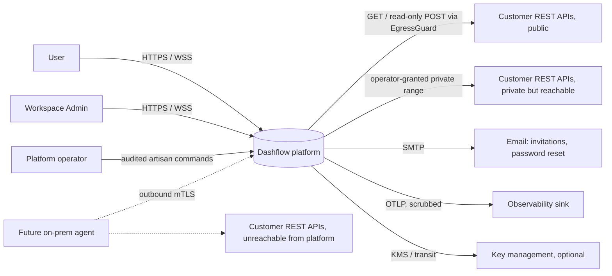
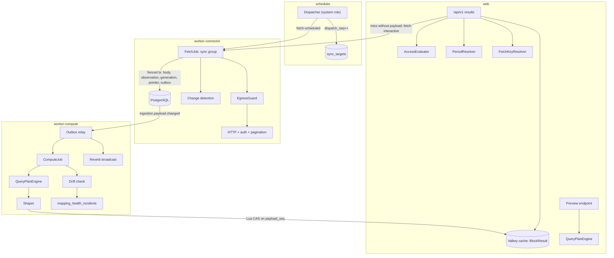
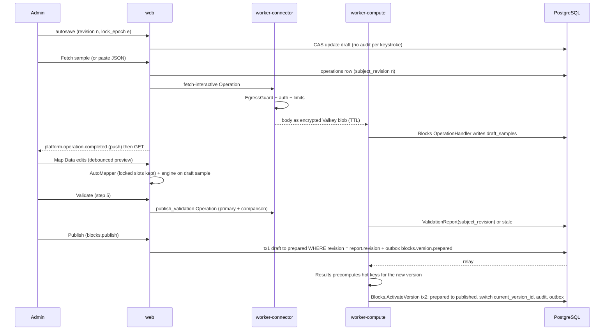
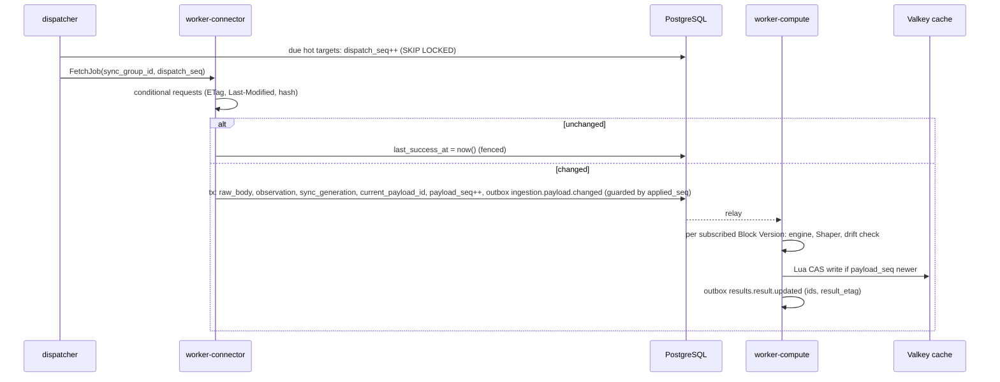
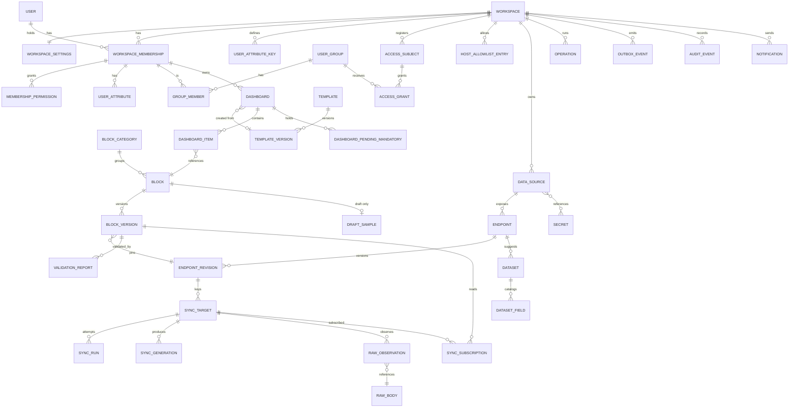
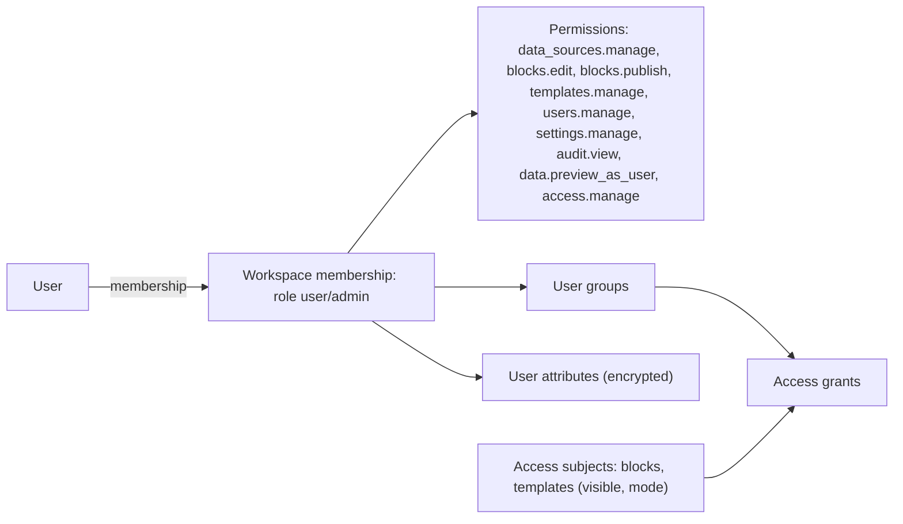
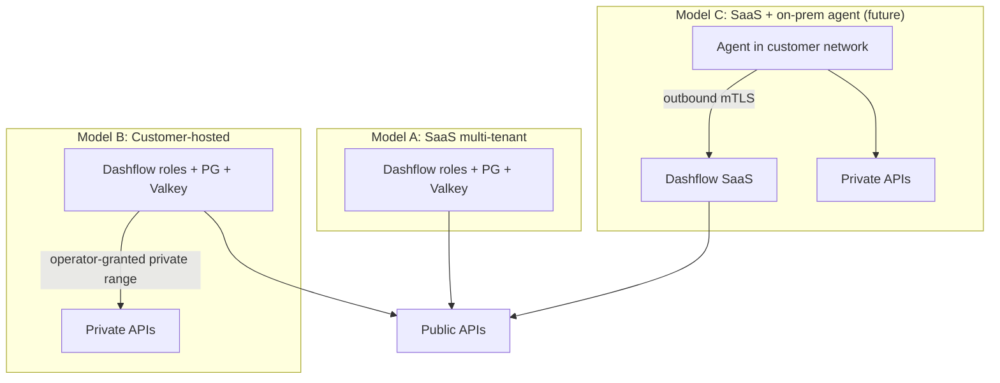

# Solution Design: Dashflow

This document explains the architecture of Dashflow and the reasons for it. The binding rules, **AD-1 to AD-34**, are in [ARCHITECTURE-SPINE.md](ARCHITECTURE-SPINE.md). Where the two disagree, the spine wins.

"**Request**" means the product owner's architecture request ([inputs/architecture-request-2026-10-05.md](inputs/architecture-request-2026-10-05.md)). "**Brief**" means product brief v4.

**Status labels**

| Label | Meaning |
|---|---|
| **[CONFIRMED]** | Decided by the product owner or client, in the PRD, UX spines, brief or request |
| **[ASSUMED]** | A working assumption, to be checked against client input |
| **[PROPOSED]** | An architecture recommendation awaiting product-owner confirmation |
| **[OPEN]** | Needs a decision; owner and timing are in §22 |
| **[ADR AD-n]** | Recorded in the spine (each AD carries its own CONFIRMED/PROPOSED tag) |
| **TBD** | No value yet. Every tunable is a named setting marked `pending_input` |

**Domain-agnostic rule [CONFIRMED].** No business domain is built into the core. RMG, finance, healthcare and every other domain exist only as Workspace configuration: Data Sources, Blocks, Templates and Categories (AD-2).

---

## 0. Conflicts between the inputs and this proposal

The product owner decides each row before stories quote either source. "Resolution" is the architecture proposal.

| # | Conflict | Sources | Proposed resolution | Status |
|---|---|---|---|---|
| **C1** | **Raw data and history.** The request asks to keep raw API data, plus history and snapshots "where needed". PRD NFR-5, §7, §9 and addendum §A, §E say: no historical copies, short-lived caches only, snapshots deferred. | Request vs PRD NFR-5 | Keep the **current raw payload per Fetch Key** as a durable last-known-good copy. It is needed for Stale display after restarts, `304` reuse, remapping without a refetch, and drift checks. `window(N days)` retention is opt-in per Data Source. Cold targets are purged after `cold_purge_after`. History features stay post-MVP. **NFR-5 amendment:** "persists the latest source response per request as a last-known-good copy; longer retention is opt-in." | **[CONFIRMED]** 2026-10-05: latest + opt-in window. PRD NFR-5 needs the amendment |
| **C2** | **Datasets and metric definitions.** The request asks how datasets, fields, dimensions, measures and governed metrics are stored. PRD v3 removed Data View and Dataset (PRD §14). | Request vs PRD §14 | An internal **Dataset suggestion catalog** (Endpoint + Record Path + typed fields + default roles), created implicitly by the wizard. Each Block Version **snapshots** the fields it uses (AD-11). A governed metric = the Calculated Field or aggregation inside a published Block Version. A Workspace Metric catalog comes post-MVP with the same AST. No UX change. | **[CONFIRMED]** 2026-10-05 |
| **C3** | **Drill-down** is a criterion in the request. PRD §9 makes it a post-MVP non-goal. | Request vs PRD §9 | Score it in §9; keep it out of the MVP. | **[CONFIRMED]** non-goal |
| **C4** | **Frontend framework.** Addendum §I lists React; the UX hint is "shadcn/ui on Radix" (React); the request says Vue 3. | Addendum, UX vs request | Vue 3.5 + TypeScript with **shadcn-vue on reka-ui**, through the Laravel Vue starter kit. | **[CONFIRMED]** by the request (Vue 3) |
| **C5** | **Pasted sample storage.** PRD FR-21 says a pasted sample is "never stored". The UX needs it kept: autosave restore (FR-2), "Pasted 09:14", mismatch kept on Save draft. | PRD FR-21 vs FR-2, UX | Store it only in `draft_samples` (encrypted with the `data` key, Draft-scoped, with a hard maximum TTL and a "contains personal data" acknowledgement). Delete it on publish or discard. It never reaches the raw tier or a version. Responses from fetch-as-user are **never** stored there (AD-30). FR-21 wording: "never stored outside its Draft". | **[CONFIRMED]** 2026-10-05. PRD FR-21 wording needs updating |
| **C6** | **Preview latency.** The UX says "every change re-renders immediately", which implies a client engine. The architecture uses one server engine (AD-11). | UX Map Data vs AD-11 | Debounced server preview, with the sample cached per `(draft, sample_revision)`. The latency target is TBD, set by a spike. Fallback: a TypeScript evaluator of the same plan, checked by a shared conformance suite. | **[CONFIRMED]** approach 2026-10-05: first-sprint spike decides |
| **C7** | **Audit export.** The brief defers exports; PRD FR-68 and the UX include an audit export. | Brief vs PRD | The PRD wins: audit CSV export is an Operation, with formula neutralization (AD-18). | **[CONFIRMED]** |
| **C8** | **Change detection without headers.** FR-13 re-fetches; the request adds a content-hash fallback. | PRD vs request | A compatible extension (AD-8). | **[CONFIRMED]** by the request |
| **C9** | **UX spine status.** DESIGN.md and EXPERIENCE.md frontmatter say `status: draft`. EXPERIENCE.md was condensed on 2026-10-05, with decisions preserved. | UX frontmatter | Mark them final, or confirm the current text as the baseline. | **[CONFIRMED]** 2026-10-05: UX spines marked final |
| **C10** | **Undefined UX items:** "system Blocks"; whether Expanded view rows are before or after top-N; step ④ preview-as "group". | EXPERIENCE.md | "System Blocks" = Mandatory Blocks. Expanded view = rows after aggregation, **before** top-N. View as table = the **displayed** data (after top-N). Preview-as = as one chosen user (a "group" means one member of it). | **[CONFIRMED]** 2026-10-05 |
| **C11** | **The brief's wizard wording** still has the Mapper inside Configure. | Brief vs PRD | Follow the PRD's five steps. | **[CONFIRMED]** |
| **C12** | **Stale semantics.** FR-13: a `304` keeps Data-as-of. FR-61: Stale when "data older than 2 × interval". Together they mean a healthy source with unchanging data goes Stale. | PRD FR-13 vs FR-61 | Stale = `now − last_success_at > 2 × the Block's interval`. Data-as-of is still displayed (AD-15). FR-61 wording: "older than allowed" means "not successfully checked within 2 × interval". | **[CONFIRMED]** 2026-10-05. PRD FR-61 wording needs updating |
| **C13** | **MFA.** FR-2: email + password, SSO deferred, MFA not mentioned. Admins manage credentials and private-network access. | PRD FR-2 vs security review | **No MFA in the MVP.** Fortify two-factor disabled; MFA arrives with SSO later. Password re-confirmation still guards sensitive Admin actions [PROPOSED]. Risk accepted (§21) | **[CONFIRMED]** 2026-10-05 |
| **C14** | **Drawer and gallery preview data.** The UX shows "Sample data" in the Add-blocks preview. v1.0 proposed real data. | UX vs v1.0 | **Synthetic sample values** generated from the version's field snapshot and presentation, labelled "Sample data". No fetch, no stored values, no cold-target wake-ups while browsing. | **[CONFIRMED]** 2026-10-05 |
| **C15** | **Log retention per Workspace.** FR-67 and NFR-13 make it a Workspace setting. Application logs and telemetry go to the deployment's sink, which the platform doesn't control. | PRD vs AD-24 | The Workspace setting governs platform-held operational records: `sync_runs`, `operations`, notifications, data-access logs. Retention of the external sink is a deployment control, documented per install. | **[CONFIRMED]** 2026-10-05 |
| **C16** | **Plain `http` to source APIs** conflicts with NFR-4 "TLS in transit". | NFR-4 | **http allowed initially; https later.** http Data Sources (with or without credentials) are allowed, badged "Not encrypted" and audited on creation. `require_https` (Workspace + deployment override, default off) turns on enforcement later with no code change. https-to-http redirects are always refused. Browser ↔ platform ingress stays TLS. **PRD NFR-4 needs an exception note** for outbound source calls in the MVP | **[CONFIRMED]** 2026-10-05 |
| **C17** | **Architecture additions to PRD wording:** a `none` auth type; Endpoint revisions pinned per Block Version; idle Fetch Keys stop refreshing (demand-driven); periods limited to enumerated presets (no free date ranges beyond the PRD's "custom", which is quantized to days); undo history lasts while the dashboard stays open (the UX wording); access changes need a permission (Q-A1); a Block's major version number is reserved for a Block Type contract upgrade, ordinary publishes increment the minor. | PRD FR-9, FR-11, FR-15, FR-59, FR-60 | Accept, or adjust per row. | **[CONFIRMED]** 2026-10-05. PRD note listing the additions |
| **C18** | **Mandatory Block the user can't access.** FR-47 adds mandatory Blocks to derived dashboards; FR-7 / B1 hide inaccessible Blocks. | PRD FR-47 vs FR-7 | Skipped and held as pending. It is added when access is granted later. Its omission is counted in `msg:template-block-omitted`. | **[CONFIRMED]** 2026-10-05 |

---

## 1. Architecture overview

Dashflow is a **modular monolith** (AD-1): one Laravel 13 codebase and one image, run as five process roles (`web`, `realtime`, `scheduler`, `worker-connector`, `worker-compute`).
- **PostgreSQL 18** is the system of record.
- **Valkey 9** is split into a `queue` store and a `cache` store. Both hold only re-derivable state (AD-17).

The pipeline separates source availability from dashboard reads:

```
External REST API
  → Connector (worker-connector; EgressGuard on every URL; auth; conditional request; limits; fenced run)
  → Raw Store (exact bytes; current payload pointer; sync generations)
  → Query Plan (versioned config; field snapshot; Dataset = suggestion catalog only)
  → Results (compute on change; materialized BlockResult; subscriptions; freshness)
  → Dashboard API (/api/v1; per-item authorization; batch never blocks)
  → Vue 3 web app (renderers per Block Type; Intl formatting; push invalidations)
```

The request's conceptual flow is **accepted with three refinements**:
1. The "semantic layer" is **configuration over raw payloads**, not a second copy of the data.
2. The "query/analytics layer" runs **when data changes** (materialized results), not per page view.
3. The external API is **never on the dashboard request path** (AD-15).

**Out of scope:** ad-hoc BI tool, data warehouse, ETL product, microservice estate.

---

## 2. Architecture principles

| # | Principle | Realized by |
|---|---|---|
| P1 | Domain-agnostic core | AD-2 |
| P2 | Configuration is separate from source data | AD-9 three tiers |
| P3 | Raw data is kept where practical, immutably and exactly | AD-9 (exact bytes), AD-33 (lossless numbers) |
| P4 | Mapping changes never destroy data | Results recompute from raw + new version (AD-9, AD-11) |
| P5 | Access is evaluated at runtime with one predicate | AD-4 |
| P6 | Content versioning and access policy are separate | AD-5 |
| P7 | Source availability is decoupled from reads | AD-15, last-known-good payload |
| P8 | Sync is asynchronous first | AD-7, AD-26 |
| P9 | Horizontal scale by role | AD-1, AD-17 |
| P10 | Split services only for security or scale | Connector role isolated for egress and credentials (AD-6, AD-19) |
| P11 | One way to do each thing | One engine, grammar, Fetch Key resolver, period resolver, results owner, layout kernel and event grammar (AD-11, AD-12, AD-7, AD-27, AD-25, AD-14, AD-29) |
| P12 | Never invent numbers | `pending_input` tunables (§22) |
| P13 | Never show a wrong number | Unavailable not 0; no truncation; fenced ordering; lossless decimals (AD-11, AD-26, AD-33) |
| **P14** | **MVP implementable: interfaces now, implementations later** | Ports exist from day one. Only these MVP drivers are built: `FetchTransport=direct`, `QueryExecutor=in-process`, `RawStore=pg`, `SecretVault=local` (plus KMS if the first customer needs it), `IdentityProvider=fortify`. Everything else is a deferred driver (spine Deferred) |
| P15 | Fail closed | Unset tenant context returns no rows; missing user context means no fetch; unknown event version is rejected (AD-3, AD-7, AD-32) |

---

## 3. System context



**Trust boundaries:**
1. Browser ↔ platform: TLS, session, CSRF, CSP.
2. Platform ↔ source APIs: EgressGuard, per-source credentials.
3. Platform ↔ agent (future): mTLS, outbound only.
4. Tenant ↔ tenant: AD-3.
5. Platform ↔ Valkey: TLS, ACLs; treated as trusted infrastructure (AD-17).
6. Platform ↔ observability sink: scrubbed telemetry only (AD-24).

---

## 4. Container and component architecture

### 4.1 Containers (process roles) [ADR AD-1, CONFIRMED 2026-10-05]

| Role | Runs | Scales by | Network | Keys (AD-19) |
|---|---|---|---|---|
| `web` | nginx + php-fpm: Inertia, `/api/v1`, preview engine, channel auth, host pre-check | request rate | ingress; PG; Valkey; **no egress to sources** | `data`, `digest` |
| `realtime` | Reverb (ext-uv, raised file-descriptor limits) | connections | ingress WSS; Valkey `queue` | none |
| `scheduler` | `schedule:run` each minute; maintenance tasks `onOneServer()`; dispatcher every `dispatch_tick` with `onOneServer()` (DB role `system`) | 1 active (scheduler mutex) | PG; Valkey | none |
| `worker-connector` | Horizon: `fetch-interactive`, `fetch-scheduled` | fetch throughput | PG; Valkey; **egress via EgressGuard** (optional enforcing proxy) | `cred`, `token`, `data` |
| `worker-compute` | Horizon: `compute`, `outbox` (relay, role `system`), `notifications`, `maintenance` (role `maintenance` for deletes) | changed payloads × subscriptions | PG; Valkey; SMTP | `data` |

FR-66 service mapping: Dashboard API = `web`; Data refresh = `scheduler` + `worker-connector` + `worker-compute`; Authentication = the `web` auth path; Notification service = `realtime` + `notifications`.

### 4.2 Backend modules and ownership [ADR AD-2, PROPOSED]

| Module | Owns (tables) | Key contracts |
|---|---|---|
| **Platform kernel** (`app/Platform`; calls no module) | `workspaces`, `workspace_settings`, `outbox_events`, `outbox_consumptions`, `audit_events`, `operator_audit`, `operations` | Tenancy (`CurrentWorkspace`, `WorkspaceTransaction`, settings with `revision`); `Outbox::emit`; `Audit::record` / `recordSecurityEvent`; `Operations` (registry, handler hand-off, initiator-only results); `EditLock` (locks, `lock_epoch` protocol); `Layout` (placement, clamp, collisions); `Period\PeriodResolver` |
| **Identity** | `users`, `sessions`, `password_reset_tokens`, `invitations` (global) | `IdentityProvider` (Fortify), session status/extend |
| **Access** | memberships, permissions, groups, `group_members`, `user_attribute_keys`, `user_attributes` (encrypted, `data` key), `access_subjects`, `access_grants` | `AccessEvaluator`, `RegisterAccessSubject`, `AccessImpact`, membership lookup (`SECURITY DEFINER`) |
| **Connector** | `data_sources` (+ `revision`), `endpoints`, `endpoint_revisions` (immutable), `secrets`, `host_allowlist_entries`, `endpoint_usage` (read model) | `EgressGuard`, `FetchTransport`, `SecretVault`, `CheckHost`, "Blocks using it" from its `endpoint_usage` read model (fed by `blocks.version.published`) |
| **Ingestion** | `sync_targets`, `sync_subscriptions`, `sync_generations`, `sync_runs` | `FetchKeyResolver`, `Subscribe` (registers or touches a subscription with interval, `compute_ctx` and resolved period), `DispatchDueSyncs`, fetch Operations (`sample_fetch`, `fetch_as_user`, `publish_validation`) |
| **RawStore** | `raw_bodies`, `raw_observations` | `RawStore` (put, current, get) |
| **Datasets** | `datasets`, `dataset_fields` (suggestion catalog) | `UpsertDataset`, `SuggestFields`, `ShapeFingerprint` |
| **Mapping** | none (engine) | `QueryPlan` schema v*n*, `QueryPlanEngine`, `QueryExecutor`, `LosslessJson`, path and expression parsers, `AutoMapper` (locked slots respected) |
| **Results** | `block_viewers` (read model fed by `dashboards.dashboard.changed`), `mapping_health_incidents` | `ResultsFor`, `ComputeBlockResult`, `Freshness`, precompute on `blocks.version.prepared` → `Blocks\Contracts\ActivateVersion`, fan-out |
| **Blocks** | `blocks`, `block_versions`, `draft_samples`, `validation_reports`, `block_categories`, `block_usage` (read model) | `SaveDraft`, `ValidateDraft`, `PublishBlock` (two-phase), `RestoreVersion`, `ActivateVersion`, `BlockImpact` (over its `block_usage` read model fed by dashboard events), `BlockVersionDiff` |
| **Templates** | `templates`, `template_versions` | `PublishTemplate` (emits `mandatory_added`) |
| **Dashboards** | `dashboards`, `dashboard_items`, `dashboard_pending_mandatory` | AD-14 commands, `NextFreeSlot` (via the Layout kernel) |
| **Notifications** | `notifications`, `notification_reads` | type catalogue (§15) |
| **Search** | `search_documents` | `Search(group, q)` per group |
| **Health** | `service_health_samples` | `PlatformHealth`, `SourceHealth` |
| **Operator** | — | artisan commands (audited to `operator_audit`) |

**Block Type packages** (`block-types/{key}/v{n}/`, first-party only, AD-21). The MVP keys are:
- `kpi-card`
- `kpi-chart`
- `line-area`
- `bar`
- `pie-donut`
- `table`
- `list`
- `progress-list`
- `activity-feed`
- `calendar-agenda`
- `text-status`

### 4.3 Frontend modules [ADR AD-20, AD-21, AD-33, PROPOSED]

| Area | Contents |
|---|---|
| Shell | Inertia layouts, workspace switcher, sidebar/icon rail, top bar, ⌘K, bell, connection banner, session-expiry dialog (BroadcastChannel across tabs) |
| Sign-in | Role choice, Remember me, Forgot password (no MFA in the MVP, C13) |
| Admin | Overview, Block management, five-step wizard with Mapper and live preview, Draft/Published lists, Categories, Templates editor, User configuration, Data sources, System settings, Audit log |
| User | Overview, My dashboards, Templates gallery, Add-blocks Panel, Edit Layout Mode, Expanded view |
| `block-types/*/v*` | Renderers |
| `lib/api` | Typed `fetch` client (`X-XSRF-TOKEN`, `X-Request-Id`, `X-Background: 1` for background calls), error envelope, Echo/Reverb with polling fallback |
| `lib/charts` | `useChart` wrapper (AD-21) |
| `lib/format` | `Intl` formatting from format descriptors; `{user.*}` token resolution; safe URL builder (AD-33) |
| `components/ui` | shadcn-vue / reka-ui themed with DESIGN.md tokens as CSS variables |

State: one Pinia store per module. Results are cached in memory by `result_etag`. Undo history for add, remove and layout lives client-side for the open dashboard [CONFIRMED UX]. Its server operations are `RestoreItem` and `RemoveItem`.

### 4.4 Component view of the data path [ADR AD-15, AD-25, AD-26, PROPOSED]



---

## 5. Major data flows

### 5.1 Admin builds and publishes a Block (UJ-1)



Audit records Draft created, discarded, restored, validated and published. It does **not** record each autosave.

### 5.2 User opens a dashboard (AD-15, AD-20)

1. The Inertia page carries `{dashboard_id, revision}` and the shell.
2. `GET /api/v1/dashboards/{id}` returns the layout and items, with clamped geometry. Each item carries `state` (`access_removed`, `unpublished` or available), `refresh_interval`, `is_live`, a User-safe Block DTO, and `next_free_slot` hints.
3. `GET /api/v1/dashboards/{id}/results?range=<preset>` runs, for each item:
   - re-check `canUse`;
   - `PeriodResolver`;
   - `FetchKeyResolver` (fail closed on missing context);
   - read `res:` from Valkey.
4. The response carries hits with `data_as_of`, `last_success_at`, `stale_at`, `result_etag`, plus `pending` for misses, and the header's oldest Data-as-of over Live items (FR-62).
5. A miss with a current payload enqueues compute. A miss without one enqueues `fetch-interactive`. Results touches the subscription through `Ingestion\Contracts\Subscribe` (throttled), which keeps the target hot.
6. The client subscribes to `workspace.{ws}.membership.{m}` and to the shared-Block channels. On `results.result.updated{block_id, result_etag}`, it refetches the items that changed.

### 5.3 Scheduled sync and propagation



### 5.4 New version (UJ-2, UJ-6)

Publishing is two-phase (AD-13). Readers keep the old version until the switch, so the change never passes through an empty state. Layouts don't move. A clamp that can't fit keeps the old size; the publish dialog reports this beforehand.

### 5.5 Access change (FR-7)

One transaction commits the grant change, `access_subjects`, the audit event and the outbox event `access.grant.changed`. Affected sockets are forced to re-authorize. Clients refetch the layout. Removed items return `access_removed` with no data, and **Remove** is still allowed (it requires ownership only). The impact count ("38 users will lose this block") comes from `AccessImpact`: active memberships allowed now and not allowed after the change.

---

## 6. Data ingestion and synchronization architecture

### 6.1 Data Source and Endpoint configuration

| Concern | Design |
|---|---|
| **Authentication** [PROPOSED per FR-9 + C17] | `none`, `api_key` (header preferred; query placement allowed with a warning), `bearer`, `basic`, `oauth2_client_credentials`. The token URL passes the EgressGuard, follows no redirects and accepts only JSON under a size cap. The token is cached as `oauth:{ws}:{ds}:{secret_version}` (`token` key) until `expires_in − skew`; on a 401 it refreshes once |
| **Headers** | Data Source defaults, plain or **secret** (write-only). Endpoint headers may bind user context. Bound header values reject CR/LF and non-visible ASCII |
| **Parameters** | Bindings are `fixed`, `period.start/end` (from `PeriodResolver`) or `user_context.<key>`. Path segments are percent-encoded, with `/`, `.` and `..` rejected. Query values go through the client's query builder. POST bodies place bound values only at typed JSON positions. Templates are parsed once into a URL AST |
| **Methods** | GET. POST only when `read_only_query` is set, which requires `data_sources.manage` and a risk confirmation and is audited. POST runs with no automatic retry on ambiguous failures, is excluded from Live, and sends an `Idempotency-Key` |
| **Pagination** | Set on the Data Source [CONFIRMED UX default]: `none`, `page`, `offset`, `cursor` (a token, never a URL), `link_header` (next URL must be same-origin). Bounded by `max_pages` and `max_bytes` (measured on the **decompressed** stream). On the limit: `connector.limit_exceeded`, nothing stored |
| **Refresh interval** | Per Block, from the Workspace allowed set. Live (~30 s) only on `live_capable` sources and within the budget. Effective interval of a target = the minimum over hot subscriptions (AD-25). If a source loses Live or an interval is withdrawn, published versions keep their value; the scheduler clamps to the nearest allowed interval and notifies Admins with an impact list [PROPOSED] |
| **Timeouts** | `connect_timeout` and `total_timeout` per Data Source, under a platform ceiling (TBD) |
| **Content** | JSON only (Content-Type check **and** a successful parse). A depth limit and a byte limit apply before parsing |
| **Transport** | `direct` (MVP); `agent` (future) |

### 6.2 Fetch Keys, sync targets and groups [ADR AD-7, AD-26]

- **Canonical form.** Only `FetchKeyResolver` computes keys, with golden-vector tests:
  ```
  fetch_key = "fk1:" + hex(sha256(JCS({v:1, workspace_id, endpoint_revision_id, data_source_revision,
                                       params:{name:{t,v}}, ctx})))
  ```
- **User context.** `ctx = "shared"` or `HMAC(digest_key[ws][ver], "bound|" + JCS(attrs))`. Users with identical bound values **share** a target. This is correct only when the API scopes by those values. An Endpoint can set `scope_by_caller=true` to include the membership ID in `ctx` [PROPOSED]. A missing bound attribute means **no fetch** (AD-30).
- **Sync groups.** A comparison Block's primary target links its prior-period target. One FetchJob fetches the group under one fence. If both calls succeed, it writes one `sync_generations` row. If the comparison fails, the generation is written with that side marked failed, and the comparison slot shows `unavailable`.
- **Demand-driven scheduling.** Ingestion owns `sync_subscriptions` (AD-7); Results registers them through `Subscribe`.
  - A target is hot while any subscription has `hot_until > now()`, where `hot_until = last_access_at + hot_window` (TBD).
  - Hot targets dispatch at the effective interval.
  - Cold targets get the low-frequency health probe on one representative target per Endpoint revision.
  - `cold_purge_after` (TBD) deletes cold per-user targets, their payloads and their results.
- **Period rollover.** The dispatcher pre-warms the next window's keys for hot rolling targets within `prewarm_lead` (TBD) before the Workspace-local boundary, with jitter.
- **Budgets.** Per workspace: maximum hot keys, maximum fetch rate per Data Source, maximum new cold keys per membership per hour (all TBD). When a budget is exceeded, the effective interval widens and the item is marked; work is never queued without limit.

### 6.3 Change detection [ADR AD-8, CONFIRMED (ETag preference) + PROPOSED]

| Source provides | Request | Unchanged when | Effect |
|---|---|---|---|
| `ETag` | `If-None-Match` | `304` | `last_success_at = now()`; current payload kept; no compute |
| `Last-Modified` only | `If-Modified-Since` | `304` | same |
| neither | GET | the hash of lossless-canonical bytes (whitespace and key order normalized, number lexemes as received) is equal | same |

The conditional state resets when `endpoint_revision_id` or `data_source_revision` changes.

### 6.4 Failure handling, retries, rate limits [PROPOSED; values TBD]

| Condition | Behaviour |
|---|---|
| Network error, timeout, 5xx, 408 (GET only) | Exponential backoff with full jitter (base and cap TBD), up to `max_attempts` (TBD), all within the interval |
| 429 / 503 + `Retry-After` | Honour it (capped); drain the Data Source token bucket |
| 401 + OAuth2 | Refresh once, retry once; then `connector.auth_failed` |
| Other 4xx | No retry; Admin-visible configuration error |
| Limit, non-JSON, depth | No retry; error; last-known-good kept |
| Circuit breaker per Data Source | Opens after N failures (TBD); half-open probe after cool-down |
| Rate limits | Token bucket per Data Source (and optionally per Endpoint) plus a concurrency cap; per-workspace fairness caps |
| Interactive Operations | Per-membership and per-workspace limits on Test, Fetch sample, Fetch as user, Validate and preview |
| Manual refresh (FR-60) | Per membership per item; the response carries `retry_after` |
| Late or duplicate runs | Fenced by `dispatch_seq` / `applied_seq`; recorded as `superseded` (AD-26) |
| Test connection errors | Collapsed to a few user-facing codes; details go to operator logs; repeated `connector.ssrf_blocked` raises an alert |

### 6.5 Source health (FR-12, FR-66) [PROPOSED; thresholds TBD]

- `healthy`, `degraded` or `unreachable`, from a rolling window of `sync_runs` and breaker state. Thresholds are TBD.
- A `304` counts as success.
- **On Data Source save**, a probe runs: the base URL or an optional health path. Until then the source shows "Checking…". A source with no Endpoints shows the result of that probe.
- A state change notifies Admins.

### 6.6 Schema and response validation

| When | Validates | On failure |
|---|---|---|
| Paste | Byte and depth limits, JSON syntax, candidate Record Paths with row counts, pagination-like hint | Parse error location |
| Map Data | Required slots confirmed (T2), types, aggregations, expressions | Continue disabled |
| Publish validation | **Real API** primary and comparison against `config.fields` and the plan; negative check for `requires_user_context` (fetch without the attribute must refuse) | Publish disabled with the mismatching paths |
| Every new payload | Against each subscribed version's field snapshot | Missing field → slot `unavailable`. Repeated → `mapping_health_incidents` with **match suggestions computed while both old and new payloads are available** (`msg:api-match-found`). Admins with `blocks.edit` and the owner are notified |
| Health probe | Same drift check | Same |

### 6.7 Sample versus production response

| | Fetched sample (own context or shared) | Pasted sample | Fetch-as-user / preview-as | Production |
|---|---|---|---|---|
| Stored | `draft_samples` (`data` key), TTL | `draft_samples`, `origin=pasted`, TTL | **Not stored**; Operation blob, initiator only, minutes | Raw Store |
| Used for | Mapping and preview | Mapping and preview | Preview by the initiator; value-free shape only | Runtime and validation |
| Publishable | Only via publish validation | Never | Never | — |

### 6.8 External and internal IDs (AD-10)

- Platform keys are UUIDv7 generated in the app.
- A record key is a Dataset field flagged `is_record_key`: text, namespaced, never a foreign key. It gives table and list rows stable keys across refreshes.
- Without a record key, the position index is used.

### 6.9 Future connectors

- `FetchRequest` (versioned; `secret_ref`s, never values) and `FetchResponse` form the transport contract.
- **Agent (post-MVP):**
  - outbound-only mTLS connection to an agent gateway route (isolated and rate-limited);
  - per-agent certificates with rotation and revocation;
  - bound to a workspace and to Data Sources;
  - the agent enforces its own allowlist, so the platform can't pivot through it;
  - credentials may stay in the agent.
- New source types (database, file, stream) are `SourceAdapter`s that produce the same raw tier. Deferred per PRD §9.

---

## 7. Data and storage architecture

### 7.1 PostgreSQL as primary datastore

PostgreSQL 18 fits every need with no extension required:
- relational configuration;
- immutable versions (enforced by triggers);
- RLS;
- declarative partitioning;
- `bytea` with lz4 TOAST compression for raw bodies;
- `tsvector` + `pg_trgm` for search;
- `SKIP LOCKED`;
- `uuidv7()`, available but the application generates IDs.

`pg_partman` is optional. TimescaleDB and Citus are rejected (licence, managed availability, not needed). **[PROPOSED]**

SQLite is never the production database [CONFIRMED by request].

### 7.2 Storage model



| Requested item | Stored as |
|---|---|
| **Tenants / Workspaces** | `workspaces` (name, label, status, residency tag); `workspace_settings` (tz, locale, currency, allowed intervals, fetch limits, retention, default template, `help_links`, budgets, `revision`) |
| **Users / groups / roles** | `users` (global: email, password hash, name, avatar, locale, tz, shortcut preference); `workspace_memberships` (role `user\|admin`, status, `last_active_at`); `membership_permissions` (keys: `data_sources.manage`, `blocks.edit`, `blocks.publish`, `templates.manage`, `users.manage`, `settings.manage`, `audit.view`, `data.preview_as_user`, `access.manage`); `user_groups`, `group_members`; `user_attribute_keys` (immutable key, label); `user_attributes` (encrypted value + blind index) |
| **Dashboards** | `dashboards` (owner membership, name, `is_overview`, `template_id`, `template_version_id`, `date_range` preset, `compact_order`, `revision`, `last_viewed_at`); `dashboard_items` (block, x, y, w, h, minimized, `period_selection`, `mandatory`, `mandatory_unseen`), unique `(dashboard_id, block_id)`; `dashboard_pending_mandatory` |
| **Blocks** | `blocks` (category, tags, owner, lifecycle, `current_version_id`, `draft_version_id`); access mode lives in Access `access_subjects` |
| **Block versions** | `block_versions` (`major.minor`, state `draft\|prepared\|published` (superseded is derived), `revision`, `lock_epoch`, `draft_ui_state` (step, acknowledged warnings, slot statuses and confidence, excluded from diff and version), `endpoint_id` and `endpoint_revision_id` (indexed columns), `config` JSONB = `{schema_version, type_key, contract_version, fields (snapshot), query_plan (v), presentation, chrome, sizes, period behaviour + presets, refresh_interval, comparison}`, `shape_fingerprint`, `change_summary`, `published_by/at`); `draft_samples` (encrypted, origin, `captured_at`, `sample_revision`, `expires_at`) |
| **Access policies** | `access_subjects` (subject type and ID, `visible`, `mode all\|groups`), `access_grants` (subject, group). Unversioned |
| **API data sources** | `data_sources` (base URL, auth scheme, secret refs, plain headers, timeouts, limits, pagination, `live_capable`, rate limit, transport, `raw_retention`, `data_classification` [PROPOSED], `revision`, health); `endpoints` (current revision pointer); `endpoint_revisions` (immutable: method, path AST, bindings, body template, `read_only_query`, `requires_user_context`, `scope_by_caller`); `secrets` (purpose, ciphertext, wrapped DEK ref, key version, `ephemeral`, `expires_at`); `host_allowlist_entries` |
| **Sync metadata** | `sync_targets` (fetch key, endpoint revision, group link, encrypted resolved params and context, `etag`, `last_modified`, `content_hash`, `current_payload_id`, `payload_seq`, `dispatch_seq`, `applied_seq`, `last_success_at`, `last_checked_at`, `consecutive_failures`, `next_due_at`, `hot_until`); `sync_subscriptions` (target, block version, role, `refresh_interval`, `compute_ctx`, resolved period, `last_access_at`, `hot_until`); `sync_generations`; `sync_runs` (partitioned; sanitized URL template, status, http status, latency, bytes, error code, request ID) |
| **Raw API records / payloads** | `raw_bodies` (unpartitioned; content-addressed per target: `(workspace_id, sync_target_id, content_hash)` unique; `bytea` lz4; size); `raw_observations` (partitioned monthly; target, `seq`, body, `observed_at`, `first_observed_at`) |
| **Mapping configurations** | In `block_versions.config.query_plan` + `presentation`: versioned with the Block, never in the raw tier |
| **Datasets / fields** | `datasets` (unique `(workspace, endpoint, record_path)`), `dataset_fields` (path, inferred type, default role, record-key flag, source tz). **Suggestion catalog**: seeds new Drafts only. The per-Draft role map is authoritative while editing [CONFIRMED UX T1]; it is frozen into `config.fields` at publish |
| **Dimensions / measures** | Field Roles in `config.fields` and the plan; default aggregation from the Block Type `schema.json`, copied into the plan by AutoMapper |
| **Governed KPI / metric definitions** | MVP: calculated-field AST + aggregation in the published `config.query_plan` (C2). Post-MVP: dataset-scoped `metrics`, same AST |
| **Audit records** | `audit_events` (partitioned monthly; action, actor, membership, object, before/after allowlisted with hashes for sensitive values, request ID, IP, UA); `operator_audit` (global) |
| **Derived results** | Valkey `cache`: `res:…` (AD-25); not in PostgreSQL |

**Rejected [CONFIRMED by PRD §9 and addendum §A]:** a physical table per Block, dashboard or Template; EAV fact storage; domain tables.

### 7.3 Retention and erasure

| Data | Control | Default |
|---|---|---|
| Raw payloads | Per Data Source: `latest` or `window(N)`; never the current one; superseded swept after a grace period | `latest` (C1) |
| Cold per-user targets | `cold_purge_after` | TBD |
| `sync_runs`, `operations`, notifications | Workspace setting (C15) | TBD |
| Audit events | Workspace setting, ≥ operator floor, reductions delayed and audited | TBD per customer |
| Application logs / telemetry | Deployment sink (C15) | TBD |
| Draft samples | Hard maximum TTL from the last autosave | TBD |
| Membership removal | `access.membership.removed` → each module deletes its own rows: attributes; targets referenced only by that member's digest (refcount); their payloads and results; samples fetched as them; their dashboards; notifications; search documents. Sessions destroyed. Audit keeps the actor ID with pseudonymized display | Legal basis TBD |
| Global user deletion | Operator or self-service: every membership removed as above, then the `users` row, sessions and invitations. Telemetry and logs age out under the sink's retention (C15), which bounds the erasure SLA | Legal basis TBD |
| Data subjects inside payloads | Erased only by expiry. Erasure SLA = retention + `cold_purge_after` + backup window | TBD |

---

## 8. Governed BI architecture

"Governed" means that every number comes from a **published, versioned, permission-controlled, audited** definition, evaluated by **one engine**, over **lossless** numbers.

| Capability (PRD §1.1) | Mechanism |
|---|---|
| Typed field model | Field snapshot per version; six Field Roles [CONFIRMED]; inferred types with "Treat as …" overrides kept in the Draft |
| Governed transforms | Query Plan (fixed stage order, FR-24), declarative |
| Calculated fields | Restricted grammar → AST, type-checked at save time, interpreted with a budget (FR-25) |
| Ratio-safe aggregation | `{numerator, denominator}` kept through grouping; AVG over ratios rejected (FR-28) |
| Exact roll-ups | Lossless decode + `BcMath\Number`; one internal scale; rounding only at presentation (AD-33) |
| Period filtering | Preset resolved by `PeriodResolver`. Push-down via bindings; platform-side Time filter when the API returns a wider range. Both are part of `compute_ctx` |
| Visualization and presentation | `schema.json` slots → Shaper (typed values + format descriptors) → Renderer (`Intl`, `useChart`) |
| Expanded view / View as table | Expanded view: `rowset_ref` rows (before top-N), server-paginated (`GET /api/v1/dashboards/{d}/items/{i}/rows`). View as table: the displayed data from the render payload (C10) |
| Access | Block-level (AD-4, AD-5). Row-level scope by the source API through fail-closed user context (AD-7, AD-30) |
| Freshness | `Freshness` (AD-15) |

**Where aggregation happens (addendum §B) [PROPOSED].** Push-down through Endpoint bindings where the API supports it; platform-side always. The plan never assumes push-down happened.

**Guards** (TBD): extracted rows, group cardinality, expression evaluations, CPU/wall time, result rows. When exceeded: `mapping.guard_exceeded`, no partial result.

**Query Executor port.** The MVP executor is `InProcessExecutor`. A future `SqlExecutor` over landed rows, or a Cube Core adapter, would read the same plan (AD-23).

---

## 9. Build vs embed vs hybrid: BI evaluation (addendum §J)

### 9.1 Options

1. **Build.** Custom mapper, Dataset catalog, Query-Plan engine, Results, governance. Open-source rendering libraries (ECharts, grid).
2. **Embed.** Apache Superset (Apache-2.0; embedded SDK; guest-token RLS), Metabase (interactive/SDK embedding and sandboxing need paid Pro/Enterprise; OSS = static embeds), Power BI Embedded (capacity-priced, Azure), Grafana (AGPL).
3. **Hybrid.** Custom shell (mapper, dashboards, governance) + a headless semantic/query engine. Best candidate: **Cube Core** (Apache-2.0, `securityContext`) over data landed in PostgreSQL, rendered by our renderers.

**Decisive fact (verified 2026-10-05):** none of these engines queries REST APIs directly. Options 2 and 3 still need our connector, sync and landing pipeline, and add a second model on top.

### 9.2 Scored comparison

1 = poor, 5 = excellent. For implementation complexity, higher = simpler. Unweighted. The rationale column gives the deciding reason for each row.

| # | Criterion | Build | Embed | Hybrid | Rationale |
|---|---|---|---|---|---|
| 1 | Dynamic KPI creation (slot wizard) | **5** | 2 | 4 | Slot mapping, emphasis and comparison (FR-27, FR-29, FR-31) are Dashflow concepts. BI builders are SQL or field pickers |
| 2 | Datasets | 4 | 3 | **5** | Hybrid gains a formal semantic model; Embed defines datasets per engine |
| 3 | Dimensions / measures | 4 | **5** | **5** | Mature in engines; sufficient in Build for per-Block scope |
| 4 | Filtering | 4 | **5** | **5** | MVP needs governed filters only, not a user filter UI |
| 5 | Grouping | 4 | **5** | **5** | Build is bounded by in-process guards |
| 6 | Aggregation | 4 | **5** | **5** | Same; Build adds ratio-safety by construction (row 8) |
| 7 | Drill-down | 2 | **5** | 4 | MVP non-goal (C3) |
| 8 | Correct roll-ups | **5** | 3 | 4 | Build guarantees ratio-of-sums and lossless decimals; engines need per-measure modelling discipline |
| 9 | Trend / history | 2 | 4 | 4 | MVP trends come from the API; raw observations + SqlExecutor are the upgrade path |
| 10 | Visualization flexibility | 4 | 4 | 4 | ECharts covers the charts; list, progress, activity and calendar are custom in every option |
| 11 | Dashboard customization | **5** | 1 | **5** | Embedded dashboards have no personal layer over curated Blocks or version-safe propagation |
| 12 | Near-real-time | **4** | 2 | 3 | Embed adds a landing hop + engine cache; Build pushes on change |
| 13 | Governance | **5** | 2 | 3 | Embed duplicates versioning and permission models |
| 14 | Tenant isolation | **4** | 3 | 3 | One tenancy model vs two to keep in sync |
| 15 | Row / field-level security | **4** | 3 | 3 | FR-8 puts row scope in the API; others must land user context and re-enforce it |
| 16 | Performance | 4 | 3 | 4 | Materialized small results vs per-view engine queries |
| 17 | Scalability | 4 | 4 | 4 | All scale horizontally; Embed adds a stack |
| 18 | UX consistency | **5** | 1 | 4 | Iframes and engine UIs can't meet the UX accessibility floor or DESIGN.md tokens |
| 19 | Implementation complexity | 3 | 2 | 2 | Build: engine + renderers. Embed: integration, theming, token plumbing on top of landing. Hybrid: two models |
| 20 | Licensing / cost | **5** | 2 | 4 | Metabase embedding paid; Power BI capacity; Superset and Cube free but extra operations |
| 21 | Vendor lock-in | **5** | 1 | 3 | Build: open libraries only. Embed: dashboards, permissions and semantics live in the vendor's model and format. Hybrid: the semantic model is in Cube's schema, though Apache-2.0 and replaceable behind `QueryExecutor` |
| 22 | Extensibility | **5** | 2 | 4 | FR-33 package model vs engine plugin APIs |
| 23 | Deployment-agnostic / on-prem | **5** | 2 | 3 | Embed adds a Python/JVM/Node runtime and its own metadata DB per install |
| | **Total (of 115)** | **96** | **69** | **90** | |

### 9.3 Recommendation [ADR AD-23, CONFIRMED 2026-10-05]

**Build the governed layer. Use open-source libraries for rendering only. Embed no BI engine in the MVP. Keep the `QueryExecutor` seam for a Hybrid later.**

Why:
- Dashflow's differentiators sit above what BI engines do: the slot wizard over REST, personal layers over curated Blocks, version-safe propagation, and Unavailable rather than wrong numbers.
- Embedding still needs our whole pipeline, plus a second semantic, permission and dashboard model.
- MVP analytics are bounded per Block.

**Strongest counter-argument.** Building the engine and renderers is real effort, and an engine gives drill-down and history "for free". Answer: those are explicit non-goals (PRD §9), and the upgrade path is concrete.

**Re-run the ADR (via `bmad-correct-course`) if:**
1. Ad-hoc exploration is approved.
2. Platform history becomes MVP scope (C1).
3. Measured volumes exceed the in-process guards for common Blocks.
4. A customer mandates a BI vendor.
5. Cross-Endpoint joins become required.

---

## 10. Multi-tenancy and security architecture

### 10.1 Tenancy model [ADR AD-3, PROPOSED]

| Option | Isolation | Ops cost | Fit |
|---|---|---|---|
| **Shared schema + RLS (fail closed, FORCE)** | Logical, enforced twice | Lowest | **Chosen** |
| Schema per tenant | Stronger logical | Migrations × N | Rejected for MVP |
| Database per tenant | Strong | Highest | Offered as a **dedicated deployment** (§16) |

**Mechanics:**
- `WorkspaceTransaction` wraps every request and job and runs `set_config('app.workspace_id', id, true)`. Policies read `current_setting(…, true)`, so an unset context returns no rows.
- Under PgBouncer transaction pooling, use PgBouncer ≥ 1.21 with `max_prepared_statements` > 0.
- The `system` role is the only cross-tenant reader, limited to dispatch and relay columns. Jobs it enqueues re-enter the tenant context and re-verify every referenced ID.
- Global tables are enumerated in AD-3, and CI rejects any others.
- Caches are workspace-prefixed and verified on each hit.

### 10.2 Security controls

| Control | Design |
|---|---|
| In transit | TLS 1.2 or later [PROPOSED floor] at ingress and WSS. TLS to PostgreSQL and Valkey across hosts. Outbound: http and https both allowed in the MVP; http sources badged and audited; `require_https` switch for later (C16, CONFIRMED) |
| At rest | **Required deployment control:** encrypted volumes and managed-DB encryption, including backups. **Application-level:** secrets (`cred`, `token`), user-attribute and context values, draft samples (`data`). App-level raw-payload encryption is on for `data_classification=regulated` [PROPOSED; Q-A3], which also enables crypto-shredding by DEK deletion |
| Secrets | AD-19 key purposes; keyring mounted only into the roles that hold the purpose; rotation runbook (AD-34) |
| SSRF | AD-6: every URL; binary canonicalization; vendor CIDR deny-list; same-origin pagination; refused cross-origin redirects; credentials stripped on origin change; enforcing proxy in proxy mode; httpoxy env ignored; node-level IMDS hop limit as a backstop |
| Injection into upstream APIs | Typed URL AST; encoding per position; header CR/LF rejection; typed JSON bodies |
| Least privilege | DB roles `app`, `migrator`, `maintenance`, `system`, `operator`. Valkey ACL users per role. Containers non-root with read-only rootfs, `seccomp: RuntimeDefault`, capabilities dropped, no service-account token, default-deny egress except `worker-connector` |
| Web | Sanctum SPA CSRF; SameSite=Lax secure cookies; strict CSP (nonce scripts, `object-src 'none'`, `base-uri 'none'`, `frame-ancestors 'none'`, Trusted Types where supported); no permissive CORS; Reverb origins pinned; sign-in, reset and invitation throttles; non-enumerating responses; reset mail sent through the queue |
| Rendering | AD-21 `useChart` (richText tooltips or `encodeHTML`); lint bans; XSS fixtures; link URLs parsed and limited to http(s) or same-origin; `rel="noopener noreferrer"`, `referrerpolicy="no-referrer"` |
| No user scripts | Grammar only (AD-12) |
| Authentication | AD-31 (Fortify, invitations, grant rules, global identity protection, session rotation, password re-confirmation for sensitive actions); no MFA in the MVP (C13) |
| Data-scope protection | AD-30 |
| Audit | AD-18 |
| Supply chain | Lockfiles; failing `composer audit` / `npm audit` gates for high and critical; Renovate; pinned base-image digests; SBOM; cosign signing verified at deploy; SLSA provenance; no runtime CDN scripts; fuzz the lossless decoder and path evaluator |

### 10.3 Compliance readiness (regimes TBD) [CONFIRMED that regimes are TBD]

No conformance with HIPAA, GDPR, PCI DSS, SOC 2 or any other regime is claimed. The architecture keeps these ready:
- residency through the deployment model, where the residency tag must constrain DB, Valkey, backups and the telemetry sink, or be removed;
- encryption at rest and in transit;
- immutable audit with a retention floor and export;
- access reviews (memberships, permissions, last use);
- erasure flows (§7.3);
- `data_classification` per Data Source, which drives defaults: app-level payload encryption, short `cold_purge`, `require_https`, impersonation off, and the optional data-access log;
- telemetry scrubbing before data leaves the trust boundary;
- security alerts: SSRF blocks, repeated denials, impersonation bursts, audit export, retention reductions, new http Data Sources;
- KMS/HSM-backed SecretVault for regulated installs.

**Still to confirm with the first customer:** regimes, residency, retention defaults, whether payloads hold regulated data, breach-notification duties, RPO/RTO, and whether a read-access log is needed.

---

## 11. Authorization and access-control model

### 11.1 Model



### 11.2 Evaluation (AD-4)

`visibleSubjectIds(type, membership, area)` is one SQL fragment: the subject is `visible` (published), **and** its mode is `all` **or** it has a grant to one of the member's groups. `canUse` is `EXISTS` over the same fragment.
- The Add-blocks Panel, Templates gallery, category chips (FR-43), search and the notification fan-out all use the fragment.
- In the Admin area, Admins see all subjects for management. Viewing data still uses `canUse`.
- **Category chips (FR-43):** the distinct primary categories of Blocks in `visibleSubjectIds` that are not already on the current dashboard as Mandatory (the "On your dashboard" group is excluded, per the UX). Tags are indexed in `search_documents` but create no chips.
- Template visibility doesn't depend on its Blocks. Inaccessible Blocks are omitted at render or creation, and the omission is counted.

| Operation | Requires |
|---|---|
| View an item's result | Owns the dashboard **and** `canUse` |
| Remove an item (including access-removed) | Owns the dashboard |
| Add / restore an item | `canUse` |
| Fetch as user / preview as | `data.preview_as_user` + target in the same workspace; audited; target notified (AD-30) |
| Publish / unpublish / restore / archive | `blocks.publish` (Templates: `templates.manage` + `blocks.publish`) |
| Change access | `access.manage` [CONFIRMED Q-A1] |
| Data sources, secrets, POST flag | `data_sources.manage` |
| Grant permissions, edit attributes | `users.manage`; only permissions the granter holds; never on oneself; last-admin protection (AD-31) |
| Audit view / export | `audit.view` (export after password re-confirmation) |
| Recent block activity (overview) | Any Admin; served from Blocks activity, not the audit log |

**Immediacy.** No decision outlives a request. The read path re-checks per item before serializing. `access.*.changed` forces affected sockets to re-authorize and clients to refetch.

**Row-level scope [CONFIRMED FR-8].** Enforced by the API through user context. Fail-closed rules are in AD-7 and AD-30. A Block without bindings shows a "shared data" badge to Admins.

---

## 12. Versioning architecture

| Object | Versioned? | Mechanics |
|---|---|---|
| Block | Yes | One Draft (CAS `revision` + `lock_epoch`), immutable published versions, `major.minor`. The prospective number is fixed at Draft creation. Major is reserved for a Block Type contract upgrade (C17) |
| Template | Yes | Same |
| Endpoint | Immutable `endpoint_revisions` | Edits that affect the request create a revision; metadata edits don't. Block Versions pin a revision (C17). The Admin sees the extra load from split Fetch Keys |
| Data Source | `revision` for request-affecting fields | Part of the Fetch Key; resets conditional state |
| Field catalog | Snapshot per version | Dataset = suggestion catalog only |
| Query Plan, `config` | `v` / `schema_version` | Read-time upcasters (AD-32) |
| Block Type contract | `v{n}` directories | Kept while pinned (AD-21) |
| Access grants | No (AD-5) | Immediate, audited |
| Dashboards and layouts | No | `revision` + AD-14 commands; not audited |

**Rules (AD-13):**
- **Edit published** opens the existing Draft, or creates one from the current version.
- **Restore vN** requires `expected_draft_revision` and, when a Draft exists, `replace_draft=true` (B2). It bumps the revision and invalidates the report. Response: "Draft v1.3 created from v1.1".
- **Publish** is two-phase. The CAS on `revision = report.revision` runs inside transaction 1. An autosave arriving after publish gets `409 blocks.draft_published`.
- **Impact (FR-39)** = distinct memberships with the Block on a dashboard, plus the Templates whose current version includes it. Templates: `COUNT(dashboards WHERE template_id)`.
- **Diff** (`BlockVersionDiff`) compares the mapping, presentation, chrome and endpoint sections. `change_summary` is stored.
- **Old-version view** recomputes against that version's pinned revision payload when one exists. Otherwise it shows a skeleton with "No data for this version"; it never uses another revision's payload.
- **Session expiry mid-edit (FR-2):**
  - The client flushes autosave when the expiry warning appears and again just before expiry.
  - On a `401`, the pending delta is kept in `sessionStorage` and replayed with CAS after sign-in. Sign-in returns to the intended URL and the step stored in `draft_ui_state`.
  - `msg:session-expired` ("Your draft was saved") appears only when the flush was acknowledged.
- **Edit locks** (FR-19) cover Drafts, Template editor and Data Source forms:
  - The lock is `edit_lock:{ws}:{type}:{id}`. A heartbeat tracks user activity; TTL about 15 minutes.
  - Release goes to a dedicated endpoint (works with `sendBeacon`; token in the body).
  - **Take over:** a `platform.edit_lock.flush_requested` push goes to the holder; the server waits for acknowledgement or a timeout; it increments `lock_epoch` (PG); the taker loads the post-flush revision; the holder is notified ("Your changes were saved" only if its flush was acknowledged).
  - Forms aren't autosaved. On take-over, the holder's valid non-secret fields are saved if the holder is online, otherwise discarded with a notice [PROPOSED; UX confirm].
- **Propagation (FR-42):** instances follow `current_version_id`. Geometry is never changed except by the non-pushing clamp (AD-14). Users get the `msg:notify-version` notification.
- **Templates (FR-47):** template changes affect only new dashboards. Mandatory additions follow AD-14 (`ApplyMandatory`, `append` placement, `mandatory_unseen` cleared by an acknowledgement command, pending when there is no access, per C18).

---

## 13. Caching and performance strategy [ADR AD-17, AD-25, PROPOSED]

| Layer | What | Where | Invalidation |
|---|---|---|---|
| Conditional state | ETag, Last-Modified, hash | `sync_targets` | per fenced run |
| Last-known-good | Current payload | `raw_bodies` + pointer | pointer moves |
| **Block Results** (the materialized aggregates) | `BlockResult` DTO | Valkey `cache` (LRU, TTL ≥ hot window) | Lua CAS on `payload_seq`; key includes `compute_ctx` |
| Expanded-view rows | `rowset_ref` | Valkey `cache` | with the result |
| Published config | Block Version, Endpoint revision | APCu/Valkey, key `cfg:{ws}:{type}:{id}`, workspace verified on each hit, read through the repository | never (immutable) |
| Access decisions | none | — | — |
| Browser | Result by `result_etag`; HTTP ETag on results | memory | push |
| Admin overview metrics | Counts over `last_active_at` / `last_viewed_at` | PG queries | windows TBD |
| OAuth tokens | Per Data Source and secret version | Valkey `cache` (`token` key) | expiry or rotation |

**Performance tactics:**
- batch results that never block;
- per-result single-flight on inline compute;
- shell first, then Blocks independently;
- skeleton only on cold load;
- stable keys from record keys;
- no value animation;
- in-process preview;
- Fetch Key sharing;
- push-down;
- partitions;
- indexes on `dashboard_items(block_id)`, `sync_targets(next_due_at) WHERE hot_until IS NOT NULL`, `audit_events(workspace_id, at)`, `block_versions(endpoint_id)`.

Targets are TBD (NFR-2). A load-test harness is part of the foundation epic's definition of done.

---

## 14. Background job and queue strategy [ADR AD-1, AD-17, AD-26, PROPOSED]

**Engine:** Laravel queues on the Valkey `queue` store (non-cluster, `noeviction`), supervised by Horizon. Jobs are versioned, carry IDs only and are idempotent. Recovery comes from PostgreSQL state (AD-17, AD-26).

| Queue | Role | Jobs | Notes |
|---|---|---|---|
| `fetch-interactive` | worker-connector | Operations, cold-miss syncs | Highest priority; per-membership and per-workspace caps |
| `fetch-scheduled` | worker-connector | Hot sync groups, health probes, pre-warm | Fenced by `dispatch_seq`; per-Data Source buckets |
| `compute` | worker-compute | Results on payload change and on publish (precompute), drift checks, mandatory propagation | `ShouldBeUniqueUntilProcessing` + Lua CAS |
| `outbox` | worker-compute | Relay (role `system`, SKIP LOCKED, marks `sent_at`), consumers | Per-subject ordering by `subject_seq`; `outbox_consumptions` dedupe |
| `notifications` | worker-compute | In-app notifications, email | `notifications(source_event_id)` unique |
| `maintenance` | worker-compute | Retention sweeps (role `maintenance`), partition management, reconciliation sweep, health sampling, cold purge, lock cleanup, `failed_jobs` purge | Scheduled; per-workspace loops |

**Dispatcher** (`scheduler`, every `dispatch_tick` (tunable; proposed default 5 s), `onOneServer`): it selects due hot targets with `FOR UPDATE SKIP LOCKED` under the `system` role, increments `dispatch_seq`, advances `next_due_at`, and enqueues `FetchJob(workspace_id, sync_group_id, dispatch_seq)`. Jobs that Valkey loses are re-derived on the next tick.

---

## 15. Observability and audit strategy

**Telemetry (AD-24):**
- OpenTelemetry PHP 1.15 + Laravel auto-instrumentation, exported over OTLP, with the **mandatory scrubbing processor**.
- JSON logs on stdout.
- `X-Request-Id` / trace context runs browser → web → queue → worker → outbound. "Copy request ID" shows it in the Admin area only.

**Metrics** (`dashflow.<module>.<measure>`):
- fetch count, latency, bytes and status per source;
- 304 / unchanged rate;
- retries, breaker state, superseded runs;
- refresh lag;
- Stale ratio (SM-6, via `Freshness`);
- unavailable-slot incidents (SM-5);
- queue depth and wait time;
- compute duration and guard aborts;
- cache hit ratio;
- sockets;
- sign-in failures;
- SSRF blocks;
- budget throttles.

**Health:**
- `/health/live` and `/health/ready` on every role.
- A `maintenance` job samples the four FR-66 services into `service_health_samples`. The interval and uptime window are TBD.

**Notifications (FR-64) [PROPOSED catalogue]:**

| Type | Audience | Delivery |
|---|---|---|
| New Block available | Members for whom `canUse` holds (evaluated at fan-out) | One workspace-level row + per-member read state |
| Block updated to a new version | Owners of dashboards containing it | Per member |
| Block unpublished | Same | Per member |
| Publication by another Admin | Other Admins | Per member |
| Data Source health change | Admins with `data_sources.manage` | Per member |
| Repeated mapping failure | Block owner + Admins with `blocks.edit` | Per member |
| Previewed as you (AD-30) | Target user | Per member |
| Mandatory Block added | Dashboard owner | Flag + banner (`mandatory_unseen`) |

**Audit (AD-18, FR-68).** The action list is the closed `AuditAction` enum. It covers:
- every FR-68 event;
- impersonation;
- attribute changes (values hashed);
- secret set and rotate;
- retention changes;
- exports;
- operator and system actions (to `operator_audit`, mirrored).

User layout changes and individual autosaves are not audited. The tamper-evident hash chain is standard in regulated mode [PROPOSED]. The optional read-access log aggregates daily per membership × Block.

---

## 16. Deployment architecture and options

### 16.1 Three separate questions

| Question | Options |
|---|---|
| **1. Where is the platform deployed?** | (A) SaaS multi-tenant (vendor); (B) customer-hosted, in the customer's cloud or data centre; (D) dedicated single-tenant run by the vendor |
| **2. Where do source APIs and data live?** | (i) Public internet; (ii) customer private network or VPC; (iii) third-party SaaS APIs |
| **3. How are private APIs reached?** | Customer-hosted platform inside the network (operator grant); peering, VPN or private link to a **per-tenant** egress path in SaaS; the future agent (outbound only); a customer-run tunnel (e.g. Cloudflare Tunnel, Tailscale) |



| Model | Platform location | Private APIs via | Tenancy | Status |
|---|---|---|---|---|
| A. SaaS multi-tenant | Vendor cloud | Per-tenant egress + peering/VPN, or a tunnel; later the agent. Private grants never target vendor CIDRs | Shared schema + RLS | [PROPOSED] supported |
| B. Customer-hosted | Customer infrastructure | Direct (operator grant) | One or a few Workspaces | [PROPOSED] supported |
| C. SaaS + agent | Vendor + customer agent | Agent | Shared | Deferred; contract ready |
| D. Dedicated | Vendor-run, isolated | As A | Single | [PROPOSED] same artifacts |

**The model is not locked [CONFIRMED NFR-14].** The first customer's choice is a pending input.

### 16.2 Packaging and environments [PROPOSED]

- **Image:** one signed OCI image. Multi-stage build: Composer; Vite on Node 22; PHP 8.5 with `bcmath`, `pgsql`, `redis` and `uv` (realtime); nginx. Migrations run as a one-shot job (`migrator`) **before** the rollout (AD-32).
- **Docker Compose** for single-host self-hosted and demo installs. **Helm** for Kubernetes: HPA per role, PodDisruptionBudgets, NetworkPolicies, separate Secrets per key purpose, Valkey `queue` and `cache` as separate instances or databases with their eviction policies, and optional PgBouncer.
- **Dependencies:** PostgreSQL 18 (managed or self-run; HA by the provider or Patroni-class tooling); Valkey 9 (non-cluster for queues) or any Redis-compatible service; SMTP; an OTLP collector; optional KMS / OpenBao; optional S3-compatible storage (post-MVP).
- **Environments:** `local` (Sail offers Valkey) → `ci` → `staging` → `production`, promoting the same image.
- **CI/CD (GitLab CI per addendum §I):**
  - static analysis: Pint, Larastan;
  - Pest unit, feature and architecture tests (including the RLS, `json_decode`-ban and table-ownership rules);
  - Vitest;
  - Playwright end-to-end on Chromium, Firefox, WebKit and mobile emulation (NFR-8), with a browserslist for the latest two versions;
  - axe accessibility checks;
  - Fetch Key golden vectors, conformance suites (engine, lossless decoder, layout kernel, XSS);
  - audits, SBOM, signing, Helm lint.
- **Backups (AD-34):** PostgreSQL PITR plus a separate backup of the SecretVault keyring or KMS keys. RPO/RTO TBD (NFR-6).

---

## 17. Scalability considerations [CONFIRMED horizontal scale (NFR-3); numbers TBD]

**Horizontal scale per role:**
- `web` and `realtime` are stateless (DB sessions; Reverb fan-out via Valkey; ext-uv beyond about 1,000 connections per node).
- Workers scale per queue.
- The scheduler is a single leader with batched dispatch.
- PostgreSQL scales vertically first, then with read replicas for overview and search. Partitioning bounds the large tables.

**Sizing parameters to confirm (none invented):**

| Parameter | Drives | Architectural implication |
|---|---|---|
| Tenants / Workspaces | Schema scale, fairness, key count | Shared schema with per-workspace budgets; dedicated deployments for isolation or very large tenants. The practical ceiling is to be measured by load test |
| Users | Memberships, search | Small rows; not a driver |
| **Concurrent users** | `web` / `realtime` replicas | 1 batch read + 1 socket per viewer; results served from Valkey |
| Dashboards per user | Layout payloads | Small |
| **Blocks per dashboard** | Batch size, first render | Maximum per dashboard TBD (NFR-2); batch size capped |
| **API sources / Endpoints** | Connector concurrency, buckets | Per-source caps |
| **Refresh frequency** (esp. Live) | Fetch rate | ≈ Σ hot Fetch Keys ÷ interval. **Bound Blocks multiply keys by distinct context digests**; budgets apply |
| **Response size / pages** | Worker memory, storage, compute | Guards; push-down; object-storage RawStore driver if needed |
| Ingestion volume | `compute` throughput | Unchanged payloads are skipped; compute ∝ changes × subscribed versions |
| Dashboard requests/s | `web`, Valkey | O(1) per item |
| Query complexity | Compute CPU | Guards; SqlExecutor trigger (§9.3) |
| Availability, RPO/RTO | Replicas, PG HA, multi-AZ | TBD (NFR-6) |
| Retention windows | Storage growth | Partition sizing |

---

## 18. Failure modes and resilience [PROPOSED]

| Failure | Detection | Behaviour | User-visible |
|---|---|---|---|
| Source down or slow | Timeouts, breaker | Retries in the interval; breaker; last-known-good | Stale after 2 × interval since the last success (UJ-5) |
| 429 | Status + Retry-After | Bucket drained; backoff | Possibly Stale |
| Schema drift | Field snapshot check | Slot `unavailable`; incident with suggestions | "Unavailable", never 0 |
| Oversize, bomb, depth | Decompressed byte and depth limits | Run fails; nothing stored | Stale / Admin error |
| OAuth failure | 401 | Refresh once; then `auth_failed` | Admin alert |
| SSRF / rebinding / malicious pagination | EgressGuard | Rejected + audited + alert | Admin error |
| Missing user context | Resolver | No fetch | Item `unavailable` (Admin reason) |
| Late or duplicate sync run | Fence | Recorded as `superseded` | None |
| Out-of-order compute | Lua CAS | Older write dropped | None |
| Stranded payload change | Reconciliation sweep | Re-enqueued | Delay only |
| Valkey `cache` loss | Misses | Recompute from raw; single-flight | Brief `pending` |
| Valkey `queue` loss | Health | Dispatcher re-derives; outbox re-relays unsent rows | Delay; push falls back to polling |
| Reverb outage | Socket closed | Polling fallback | "Reconnecting…" banner |
| PostgreSQL primary loss | Health | Failover (provider/HA); RPO/RTO TBD | Outage |
| Worker backlog | Queue wait | Autoscale; interactive queue isolated; budgets widen intervals | Refresh lag |
| Scheduler leader loss | Mutex TTL | Another node takes over | None |
| Publish race / displaced editor | CAS + `lock_epoch` | `409` / `423` | Clear message |
| Two tabs editing a layout | Row lock + revision + delta | `409` → rebase and retry | Usually none |
| Midnight period rollover | Pre-warm | New keys warmed in advance | None |
| Mixed-version rollout | AD-32 N−1 compatibility | Old and new run side by side | None |
| Keyring loss | — | Secrets unrecoverable unless backed up (AD-34) | Admins re-enter credentials |

---

## 19. Technology choices and rationale [stack CONFIRMED 2026-10-05]

Versions verified on 2026-10-05; evidence in [research/tech-verification-2026-10-05.md](research/tech-verification-2026-10-05.md) and [reviews/review-tech-currency.md](reviews/review-tech-currency.md).

| Area | Choice | Validation against requirements | Alternatives |
|---|---|---|---|
| Backend | **Laravel 13 / PHP 8.5** [CONFIRMED 2026-10-05] | First-party queues, scheduler, broadcasting, policies, encryption; strong PostgreSQL support; security fixes to 2028-03. Gaps filled by design: EgressGuard, SecretVault, lossless JSON (PHP has no float-as-string decode; the RFC was declined), CPU guards | Node, Go |
| Auth | **Fortify** (starter kit) + **Sanctum** (`install:api`, SPA mode) | Sign-in, reset, TOTP 2FA, throttling. Registration disabled; Teams scaffold not used; `password_reset_tokens` | Custom auth |
| Frontend | **Vue 3.5 + TS**, **Laravel Vue starter kit** (Inertia 3, Tailwind 4, shadcn-vue on reka-ui 2), **Pinia 4**, **vue-i18n 11**, **Wayfinder 0.1** (typed route helpers, kept from the kit) | Matches the request; reka-ui gives the headless accessible primitives the UX asks for. Inertia 3 has no axios, so a typed `fetch` client handles XSRF | React (addendum §I) |
| Inertia | Shell, navigation and admin CRUD only | Server-side routing and authorization for forms. Data goes through `/api/v1` (AD-20) | Full SPA (more boilerplate for CRUD) |
| Grid | **grid-layout-plus 1.1** (spike) | Vue-native; `vertical-compact` can be disabled; our own keyboard layer | gridstack.js 14 |
| Charts | **ECharts 6.1** + vue-echarts 8.3 | aria, decals, dataset API; Apache-2.0; wrapped for XSS safety | Chart.js, Highcharts |
| Database | **PostgreSQL 18** | §7.1 | — |
| Pooler | **PgBouncer ≥ 1.21** (optional) | Transaction pooling with `set_config(…, true)` and prepared statements | Direct connections |
| Cache, queue, pub/sub | **Valkey 9.1** (BSD-3), non-cluster for Horizon; any Redis-compatible store | Licence-clean for self-hosting | Redis 8 (tri-licence; fine if the customer supplies it) |
| Queues UI | **Horizon 5** | Redis-protocol only, not Cluster | Database queue |
| Realtime | **Reverb 1.x** (+ ext-uv) | First-party, self-hostable, scales via pub/sub | Pusher/Ably (fails on-prem), SSE |
| JSON | **Platform lossless decoder**; `symfony/json-path` 8.1 as test oracle | Exact decimals and hashes (AD-33) | `json_decode` (lossy) |
| Schema validation | **opis/json-schema 2.6** | Block Type schemas and configs | justinrainbow |
| Decimal maths | **ext-bcmath** `BcMath\Number` | Exact roll-ups; enabled in the image | brick/math |
| Testing | **Pest 5** (replaces PHPUnit 12 from the kit), Vitest, Playwright | Architecture tests (`arch()`) for AD-2 and AD-3 | — |
| Observability | **OpenTelemetry PHP 1.15** | Vendor-neutral, with the scrubbing processor | Vendor APMs |
| Secrets | **SecretVault**: local keyring / AWS or GCP KMS / OpenBao 2.x (MPL) or the customer's Vault | Envelope encryption by purpose | Bundled HashiCorp Vault (BSL) |
| Search | **PostgreSQL FTS + pg_trgm** | Per-group queries with the access fragment | OpenSearch, Meilisearch |
| App server | **php-fpm + nginx** | Simple | Octane / FrankenPHP (deferred) |
| **Containers** | **Docker / OCI images**, multi-stage, signed | One artifact for every deployment model (NFR-14); non-root, read-only | VM images |
| **Orchestration** | **Docker Compose** (single host) and **Helm** (Kubernetes) | Covers small self-hosted through SaaS; Helm encodes NetworkPolicies, HPA and key separation | Proprietary PaaS (lock-in) |
| CI/CD | GitLab CI (addendum §I) | — | Any CI |
| **Rejected** | TimescaleDB, Citus, embedded BI engines, microservices, GrapesJS-style builders, PGlite / offline | — | — |

---

## 20. Key ADRs

| ADR | Decision | Status |
|---|---|---|
| AD-1 | Modular monolith, five roles, one image | CONFIRMED 2026-10-05 |
| AD-2 | Module contracts, dependency graph, Access never depends on Blocks | PROPOSED (domain rule CONFIRMED) |
| AD-3 | Tenancy: RLS, fail closed, `system` role, global table list | PROPOSED |
| AD-4 | Global identity, per-membership authority, one access predicate | PROPOSED (immediacy CONFIRMED) |
| AD-5 | Access policy unversioned | CONFIRMED (B3) |
| AD-6 | Connector owns every outbound URL; EgressGuard | PROPOSED |
| AD-7 | Fetch Key canonical form; fail closed; presets; budgets | PROPOSED |
| AD-8 | ETag → Last-Modified → content-hash cascade | CONFIRMED (ETag) + PROPOSED |
| AD-9 | Raw / config / derived tiers; exact bytes; current pointer; retention | CONFIRMED retention (C1) + PROPOSED |
| AD-10 | UUIDv7 platform IDs; external keys namespaced | PROPOSED |
| AD-11 | Versioned Query Plan; field snapshot; one engine | PROPOSED (C6 spike) |
| AD-12 | RFC 9535 path subset; one grammar | PROPOSED |
| AD-13 | Lifecycle, CAS + `lock_epoch`, two-phase publish, restore | CONFIRMED (A1, B2, soft lock) + PROPOSED |
| AD-14 | Instances reference Blocks; closed layout commands; Layout kernel | CONFIRMED (D4) + PROPOSED |
| AD-15 | Read path never waits; Freshness | CONFIRMED Stale rule (C12) + PROPOSED |
| AD-16 | Push = invalidations only | PROPOSED |
| AD-17 | PostgreSQL is the record; Valkey split and hardened | PROPOSED |
| AD-18 | Audit in the same transaction; retention floor | PROPOSED |
| AD-19 | Secrets write-only; key purposes | PROPOSED |
| AD-20 | Inertia shell; `/api/v1` for data | PROPOSED |
| AD-21 | Versioned first-party Block Type packages; XSS-safe charts | PROPOSED (extensibility CONFIRMED) |
| AD-22 | Deployment-agnostic packaging | CONFIRMED (NFR-14) + PROPOSED |
| AD-23 | Build the governed BI layer; Hybrid seam | CONFIRMED 2026-10-05 |
| AD-24 | Correlated, scrubbed observability | PROPOSED |
| AD-25 | Results module and BlockResult contract | PROPOSED |
| AD-26 | Pipeline ordering fenced in PostgreSQL; sync generations | PROPOSED |
| AD-27 | PeriodResolver | PROPOSED |
| AD-28 | Operations contract | PROPOSED |
| AD-29 | Outbox, event, audit and error grammar | PROPOSED |
| AD-30 | Per-user data-scope protection | PROPOSED |
| AD-31 | Authentication assurance | PROPOSED; no MFA in MVP CONFIRMED (C13) |
| AD-32 | Release compatibility and contract evolution | PROPOSED |
| AD-33 | Lossless numbers; client-side formatting and user tokens | PROPOSED |
| AD-34 | Operations envelope | PROPOSED (values TBD) |

---

## 21. Risks and trade-offs

| Risk / trade-off | Impact | Mitigation |
|---|---|---|
| Engine + 11 renderers + lossless decoder is significant effort | Schedule | Strict function set; conformance suites; Block Types in priority order (KPI, KPI & Chart, line, bar, table first) |
| PHP CPU cost on large payloads | Latency, cost | Push-down, guards, compute on change, SqlExecutor seam |
| Server preview latency (C6) | Admin UX | Early spike; TypeScript evaluator fallback with conformance tests |
| User-context multiplication of fetches | Source overload | Budgets, hot-window scheduling, digest sharing, estimates in publish impact |
| Last-known-good payloads vs data-handling rules (C1) | Compliance | `latest` + cold purge + classification-driven encryption |
| **No MFA for Admins** (C13, accepted) | Account takeover of an Admin who manages credentials and private-network grants | Sign-in throttling, password re-confirmation for sensitive actions, session rotation, audit and alerts; MFA with SSO later; re-evaluate before onboarding a regulated customer |
| **Plain http to source APIs** (C16, accepted) | Credentials and data readable on the network path | Badge + audit; prefer private network segments; `require_https` switch; re-evaluate before onboarding a regulated customer |
| RLS complexity (transactions, pooling, system role) | Dev friction, leak risk | Kernel middleware; CI no-context test; pooled-connection tenant-alternation test |
| Fencing and generation logic is subtle | Bugs | Formal state diagram in the connector epic; property tests on out-of-order runs |
| Single-leader dispatcher | Bottleneck at scale | Batching; sharding by key hash later |
| grid-layout-plus maturity | Layout bugs | Spike criteria; gridstack fallback |
| Two-phase publish adds latency | Admin wait | Precompute only hot keys; activate after `precompute_timeout` regardless; uncached items show `pending` briefly |
| Valkey as a code-execution boundary | Credential exposure | ACLs, TLS, network isolation, IDs-only jobs |
| Admin insider access to scoped data | Privacy | AD-30 permission, ephemerality, audit, target notification, no self-edits |
| No maker-checker | Mistakes published | Validation gate, impact, diff, restore, audit |
| No platform history | Missing trends | Comparison requests; `window(N)` + SqlExecutor path |

---

## 22. Open questions and TBDs

**All product-owner decisions were made on 2026-10-05** (details in §0 and `.memlog.md`):

| # | Decision |
|---|---|
| C1 | Raw data: latest last-known-good copy + opt-in retention window per Data Source |
| C2 | Hidden Dataset suggestion catalog; governed metric = formula inside a published Block Version |
| C5 | Pasted sample stored only inside its Draft |
| C6 | A first-sprint spike sets the preview latency target; TypeScript evaluator fallback |
| C9 | UX spines marked final |
| C10 | System Blocks = Mandatory; Expanded view = rows before top-N; View as table = displayed data; preview-as group = one member |
| C12 | Stale = no successful check within 2 × the Block's interval |
| C13 | No MFA in the MVP (accepted risk) |
| C14 | Generated sample values in Add-blocks and gallery previews |
| C15 | Workspace retention covers platform-held records; log retention set per installation |
| C16 | Plain http allowed initially; `require_https` switch for later (accepted risk) |
| C17 | `none` auth, endpoint revision pinning, demand-driven refresh, period presets, major version on contract upgrade |
| C18 | Mandatory-but-inaccessible Blocks held until access is granted |
| Q-A1 | Separate `access.manage` permission |
| Q-A3 | App-level payload encryption only for `regulated` Data Sources |
| UX-1 | Lock take-over saves the holder's valid non-secret form fields |
| UX-2 | Mobile add = first free slot on the 12-column layout + end of the mobile order |

**Source alignment done:** PRD updated to **v3.3** on 2026-10-05 (NFR-5, FR-61, NFR-4, FR-21, FR-7, FR-40 and §13 C17 additions; v3.2.1 archived). UX spines marked final (C9).

**Pending client inputs and tunables (all `pending_input`):**

| TBD | Feeds |
|---|---|
| API inventory: shapes, auth, rate limits, ETag support, user-context scoping, update frequency | Connector, budgets |
| Sizing: Workspaces, users, concurrent users, dashboards/user, Blocks/dashboard, sources, refresh mix, payload size, requests/s | §17, load test |
| Availability, RPO/RTO | §16, AD-34 |
| Compliance regimes, residency, retention defaults, audit floor, read-access log need | §7.3, §10.3 |
| Deployment model and network constraints | §16 |
| Session idle (Admin vs User) and Remember-me durations | Identity |
| Tunables: `dispatch_tick` (proposed 5 s), `precompute_timeout`, `hot_window`, `cold_purge_after`, `prewarm_lead`, probe interval, retry base/cap/attempts, breaker and health thresholds, manual-refresh window, guards, timeouts, budgets, draft-sample TTL, lock TTL, health-sampling interval, uptime window, overview metric windows, internal decimal scale | `config/dashflow.php` |
| Live end-to-end freshness target (NFR-1) | Scheduler |

---

## 23. MVP architecture versus future evolution

| Area | MVP | Future (trigger) |
|---|---|---|
| Sources | REST/JSON, direct egress | Agent transport; database, file and stream adapters |
| Raw data | `latest` (+ opt-in window) | History and platform trends; object-storage driver |
| Query | In-process executor | SqlExecutor / Cube Core; drill-down; multi-Endpoint Blocks |
| Semantic layer | Suggestion catalog; metrics in versions | Workspace Metric catalog; export/import between Workspaces |
| Governance | Publish permission, versions, diff, impact, audit | Maker-checker; read-access log; hash chain by default |
| Identity | Fortify email + password (no MFA, C13) | SSO (SAML/OIDC), SCIM-sourced attributes |
| Realtime | Reverb invalidations + polling | — |
| Frontend | Light theme, English, 11 Block Types | Dark theme, brand override, translations, more Block Types |
| Runtime | php-fpm | Octane; sharded dispatcher |
| Operations | Artisan operator commands | Operator console; usage metering |
| Deployment | Compose + Helm, one image | Marketplace images; dedicated-tenant automation |

**Epic structure.** The architecture's module seams (platform foundation, connector and sync, query engine, results, Block Types, wizard, access UI, templates, dashboards, search and operations, deployment) were regrouped into **9 user-value epics** in `_bmad-output/planning-artifacts/epics.md` (155 stories). Each story creates only the tables it needs, and the module ownership rules of AD-2 still apply. This replaces the earlier 11-epic table. Deployment packaging (Compose and Helm) is confirmed for the MVP and sits in Epic 9.
